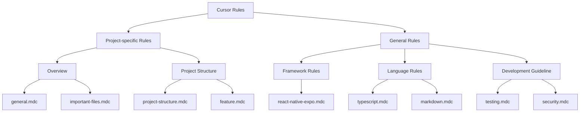

# Cursor Rules Overview

Cursor is an AI-assisted programming tool that uses rule files to guide its behavior. The goal of this project is to collect, organize, and standardize these rule files so that developers can make more effective use of Cursor in their development work.

## Rule Structure

## Features

- Collect Cursor rule files from different projects
- Classify and organize rule files
- Provide standardized rule templates
- Facilitate sharing and reuse of rules across projects

## Usage

1. Browse the rules for the relevant language and framework
2. Apply the applicable rules to your project
3. Contribute your own rules back
