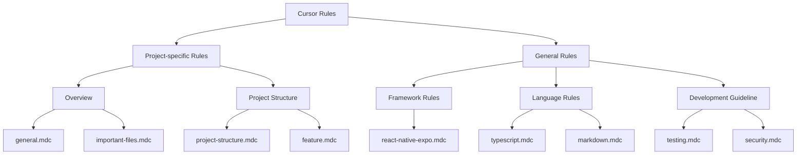

# Cursor Rules Overview

Cursor uses rule files to guide its behavior. Rules allow you to provide system-level guidance to the Agent and Cmd-K AI. Think of them as a persistent way to encode context, preferences, or workflows for your projects or for yourself.

The goal of this project is to collect, organize, and standardize these rule files so that developers can make more effective use of Cursor in their development work.

## Types of Rules

Cursor supports three types of rules:

### 1. Project Rules

- Stored in `.cursor/rules`, version-controlled and scoped to your codebase
- Written in **MDC** (`.mdc`) format, a lightweight format that supports metadata and content
- Can be organized in nested directories throughout your project structure
- Support four rule types:

  - **Always**: Always included in the model context
  - **Auto Attached**: Included when files matching a glob pattern are referenced
  - **Agent Requested**: Rule is available to the AI, which decides whether to include it
  - **Manual**: Only included when explicitly mentioned using @ruleName

### 2. User Rules

- Global to your Cursor environment, defined in **Cursor Settings > Rules**
- Always applied to all projects
- Written in plain text format (do not support MDC)
- Use for setting response language, tone, or personal style preferences

## Project Rule Structure

## Auto Rule Generation

Cursor provides powerful capabilities for automatically generating rules directly from your conversations and workflows. This feature helps you capture and reuse successful patterns without manually writing rule files.

### Generating Rules from Conversations

You can generate rules directly in a conversation using the `/Generate Cursor Rules` command. This is particularly useful when:

- You've had a conversation where many decisions were made about how the agent should behave
- You want to capture successful patterns and workflows for future reuse
- You need to standardize approaches across your team or projects

**How to use:**

1. During or after a productive conversation with the AI
2. Type `/Generate Cursor Rules` in the chat
3. The AI will analyze the conversation and create appropriate rule files
4. Review and customize the generated rules as needed

### Best Practices for Auto-Generated Rules

When using auto rule generation, consider these guidelines:

- **Capture Decision Points**: Generate rules after conversations that establish clear patterns or decisions
- **Review and Refine**: Always review auto-generated rules and customize them for your specific needs
- **Organize by Context**: Use the appropriate rule type (Always, Auto Attached, Agent Requested, or Manual) based on when the rule should apply
- **Keep Rules Focused**: Generated rules work best when they capture specific, actionable guidance rather than general preferences