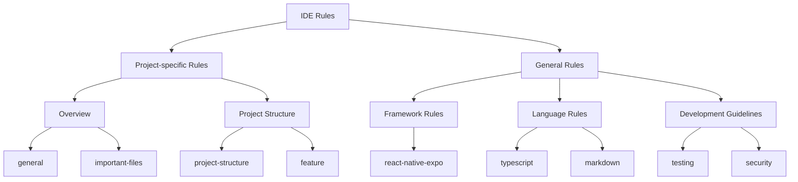

# IDE Rules Overview

AI-powered IDEs use rule files to guide their behavior. Rules allow you to provide system-level guidance to AI assistants and development tools. Think of them as a persistent way to encode context, preferences, or workflows for your projects.

The goal of this project is to collect, organize, and standardize these rule files so that developers can make more effective use of AI-powered IDEs in their development work.

## Supported IDEs

This collection supports multiple AI-powered development environments:

- **Cursor**: Uses `.cursor/rules` directory with MDC format
- **Kiro**: Uses `.kiro/steering` directory with Markdown and YAML front-matter
- **Other AI IDEs**: Adaptable format for future AI development tools

## Types of Rules

### Cursor Rules

Cursor uses rule files stored in `.cursor/rules`, version-controlled and scoped to your codebase. They are written in **MDC** (`.mdc`) format, a lightweight format that supports metadata and content.

Support four rule types:

  - **Always**: Always included in the model context
  - **Auto Attached**: Included when files matching a glob pattern are referenced
  - **Agent Requested**: Rule is available to the AI, which decides whether to include it
  - **Manual**: Only included when explicitly mentioned using @ruleName

### Kiro Steering Documents

Kiro uses steering documents stored in `.kiro/steering`, written in Markdown with YAML front-matter. They support three inclusion mechanisms:

  - **Always Included (Default)**: Documents without front-matter are included in every interaction
  - **File Match Conditional**: Documents with `inclusion: fileMatch` and `fileMatchPattern` are included when specific files are in context
  - **Manual Inclusion**: Documents with `inclusion: manual` are only included when explicitly referenced with `#steering-name`

### User Rules

- Global to your IDE environment, defined in IDE Settings
- Always applied to all projects
- Use for setting response language, tone, or personal style preferences

## Project Rule Structure

## Auto Rule Generation

Modern AI IDEs provide powerful capabilities for automatically generating rules directly from your conversations and workflows. This feature helps you capture and reuse successful patterns without manually writing rule files.

### Generating Rules from Conversations

You can generate rules directly in a conversation using IDE-specific commands:

- **Cursor**: Use `/Generate Cursor Rules` command
- **Kiro**: Rules can be generated from conversation patterns and workflows

This is particularly useful when:

- You've had a conversation where many decisions were made about how the AI should behave
- You want to capture successful patterns and workflows for future reuse
- You need to standardize approaches across your team or projects

**How to use:**

1. During or after a productive conversation with the AI
2. Use the IDE-specific command to generate rules
3. The AI will analyze the conversation and create appropriate rule files
4. Review and customize the generated rules as needed

### Best Practices for Auto-Generated Rules

When using auto rule generation, consider these guidelines:

- **Capture Decision Points**: Generate rules after conversations that establish clear patterns or decisions
- **Review and Refine**: Always review auto-generated rules and customize them for your specific needs
- **Organize by Context**: Use the appropriate rule type based on when the rule should apply
- **Keep Rules Focused**: Generated rules work best when they capture specific, actionable guidance rather than general preferences