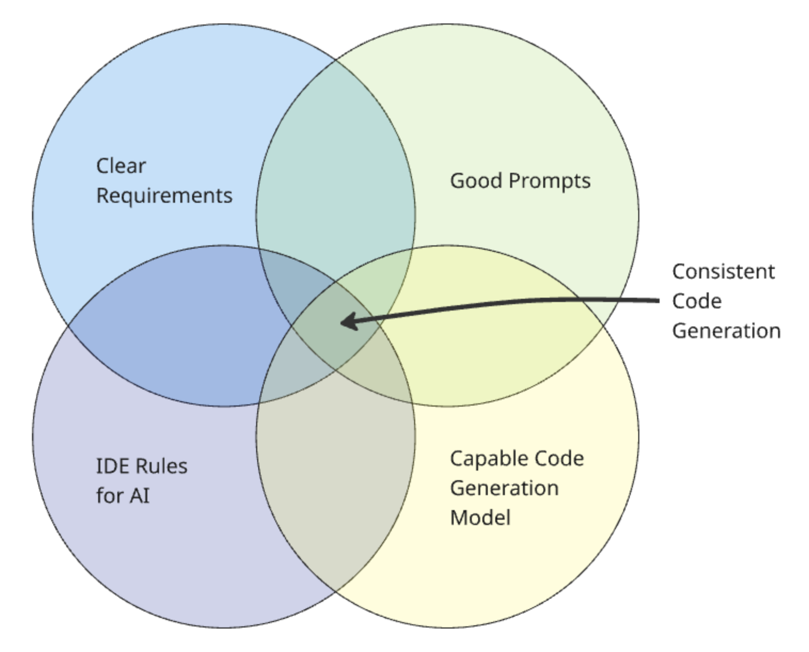

# 1. Getting Started

To get started on feature-based development with AI workflow, it's helpful to have a conceptual understanding of how to use this playbook to generate quality, consistent code.

## Workflow overview

Below is a diagram that provides a high-level overview of the steps defined in Feature-Based Development worflwo. For the most part, this development workflow follows recognized best practices already established throughout government, with the additional aid of AI tools and techniques.

*Image: Development workflow diagram*

### Stage ownership and focus

The following table outlines the primary owners and focus areas for each stage of the workflow:

| Stage | Owner | Contributors | Focus Area |
|-------|---------------|----------------------|------------|
| **Requirements** | Product Manager | Business Analyst, UI/UX Designer | What the user needs in business terms and what the product must do to satisfy user needs |
| **Technical Design** | Solution Architect | Dev Team, UI/UX Designer | How the product functions in detail and how the system will be implemented technically |
| **Implementation** | Dev Team | QA | What the system must achieve, including non-functional aspects, and how features are built and validated |
| **Change Management** | Product Manager | Business Analyst, Solution Architect, Dev Team | How changes are evaluated, approved, and integrated across all stages |

This collaborative approach ensures that each stage benefits from the right expertise while maintaining clear accountability for outcomes.

## Workflow stages

###  Requirements

- **Product Idea / Business Goals** - This represents the problems to be solved for your users using existing service design and user research techniques, documented as User Requirements Specification (URS).
- **Requirement Specification** - Using advanced models, such as the latest "thinking" models, the clearly defined ideas can be used to generate detailed requirements documentation including Product Requirements Document (PRD) and Functional Requirements Specification (FRS) that the AI IDE can later use to generate code.
- **System Requirements** - For complex systems, define additional System Requirements Specification (SRS) to handle technical and non-functional requirements, otherwise inline these requirements into the main requirement specification.

### Design

- **Technical Design** - The requirements document is then used to create a detailed technical specification including Technical Design Specification (TDS), Architecture Decision Records (ADR), and Design Specifications that define the architecture, implementation approach, and technical details needed for development.

### Implementation

- **Implementation Plan** - Generate a Work Breakdown Structure (WBS) and specific tasks based on the technical design to organize development work.
- **Development** - Both tests and application code are generated from the technical specification in the AI IDE, following the planned tasks and ensuring the business logic defined in the requirements are tested independently from the code generation.
- **Code Review** - A Pull Request (PR) in git is generated following traditional development practices, with Model Context Protocol (MCP) tools assisting in the review process. Each line of code is reviewed for quality and brevity, ensuring that the code to be deployed is production-ready.
- **Documentation** - Documentation is kept up to date by prompting the AI IDE to update documentation based on the changes that have been made, once the PR is approved.

### Change Management

- **Requirement Changes** - Handle change requests through a structured process that evaluates scope impact and determines whether changes require updates to existing documentation or new versions.
- **Scope Changes** - Minor changes update existing requirements and technical design documents, while major changes may require stopping ongoing development and creating new versions of requirements and design documentation.
- **Implementation Re-planning** - When changes occur, the implementation plan is updated to reflect new requirements and design decisions, ensuring development tasks remain aligned with updated specifications.

### Key feedback loops

The workflow includes several important feedback loops that ensure quality and alignment throughout the development process:

- **Design → Requirements feedback loop** - During technical design creation, technical constraints and feasibility considerations may reveal gaps or ambiguities in the requirements that need clarification or refinement. This feedback ensures requirements are technically sound and implementable.

- **Implementation → Design feedback loop** - During development, implementation challenges or discoveries may identify issues with the technical design that require updates to the architecture, design patterns, or technical specifications. This ensures the design remains practical and effective.

- **Change Management → Requirements, Design & Implementation feedback loops** - Change management processes provide structured feedback to all previous stages:

  - **To Requirements**: Change requests may reveal missing or incorrect requirements that need updating or new requirement versions
  - **To Design**: Requirement changes often necessitate updates to technical design and architecture decisions  
  - **To Implementation**: Changes require re-planning of implementation tasks and may disable or modify ongoing development work

These feedback loops are essential for maintaining quality and ensuring that each stage builds appropriately on the previous stages while accommodating new learnings and changing requirements.

## Generating Consistent Code

To generate consistent code, multiple elements must come together as depicted in this diagram:

*Image: Venn diagram depicting the intersection of elements for consistent AI code generation*

| Element                       | Purpose                                                                                                                                                                                                                                  | Where created                                                                                                                                                                                                                                                    |
| ----------------------------- | ---------------------------------------------------------------------------------------------------------------------------------------------------------------------------------------------------------------------------------------- | ---------------------------------------------------------------------------------------------------------------------------------------------------------------------------------------------------------------------------------------------------------------- |
| Clear Requirements            | Defines (with detail and clarity) the functional and pseudo-technical requirements for the product/service idea you want to implement.                                                                                                   | Using an advanced "thinking" chat model like Claude or ChatGPT. - Ref: [Product Requirements Workflow](02-requirement-specification.md)                                                                                                                      |
| Good Prompts                  | The clear, detailed ask for a given task. It can refer to the IDE rules and the requirements, however, it is not necessary to repeat what's in the rules or requirements in the prompt.                                                  | Prompts are initially created manually but then can be further refined using a chat model like Claude or ChatGPT. - Prompt engineering and meta prompting is explained further in the playbook: [Prompting Guidance](../../prompt-library/prompting-guidance.md) |
| IDE Rules for AI              | IDE rules define consistent and repeatable standards, patterns and conventions across the codebase. Rules can be applied for each task-specific prompt.                                                                                  | Rule file formats are usually defined by the AI IDE tool. To aid in generating the rules themselves, a chat model like Claude or ChatGPT can be used. - Ref: [Language-specific playbook rules files](../../ide-rules/languages/README.md)                         |
| Capable Code Generation Model | Using the most capable LLM model for the task you are running is important for good quality results. Not all tasks require advanced models, so selection of the most cost-effective model that can achieve the desired outcome is ideal. | The AI IDE tools typically allow the user to select which model is used when prompting the LLM. - Currently, the latest Claude Sonnet models are recommended starting models for quality code generation.                                                     |

## Next steps

To get started, ensure that your [project is set up for AI development](../project-setup.md) and follow the steps in the [Playbook Workflow](../README.md). **IMPORTANT - this includes ensuring that privacy settings are enabled, per the [project is set up](../project-setup.md) section.** 

We also advise reading and understanding the detailed [Prompting Guidance](../../prompt-library/prompting-guidance.md) before you start.

## Related Resources

- [Glossary](../../glossary.md) - Key terms and definitions
- [IDE Rules Overview](../../ide-rules/README.md) - Setting up IDE rules for consistent AI behavior
- [MCP Server Overview](../../mcp-server/README.md) - Extending AI capabilities with external tools
- [Prompt Library](../../prompt-library/README.md) - Ready-to-use prompts for common tasks
