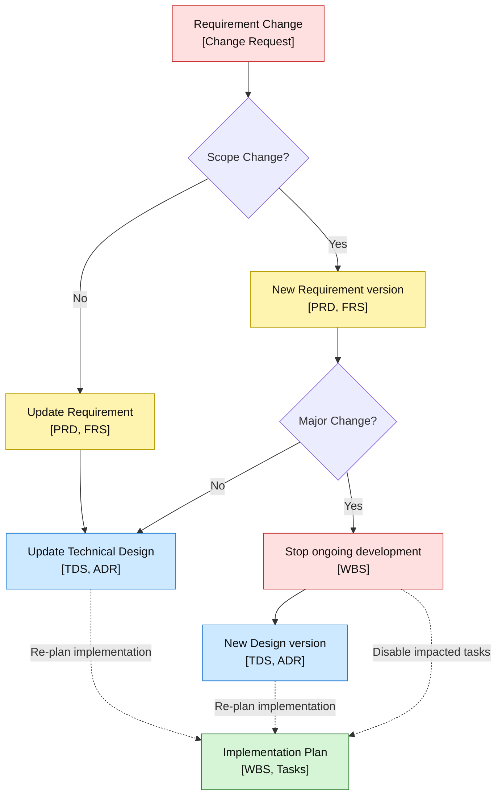

# 5. Change Management

Change management in feature-based development ensures that requirement and technical design specifications remain synchronized with implementation status. This structured approach to handling changes maintains consistency across all workflow stages while preserving the quality and integrity of the development process.

## Overview

Change management serves as the critical feedback mechanism that keeps all project artifacts—requirements, technical designs, and implementation—aligned throughout the development lifecycle. Without proper change management, documentation becomes outdated, requirements drift from implementation, and technical debt accumulates rapidly.

### Key Principles

The fundamental principle of change management in AI-powered development is maintaining **synchronization between specifications and implementation**. This ensures that:

- Requirements documents accurately reflect the current system functionality
- Technical design specifications match the implemented architecture
- Implementation decisions are properly documented and communicated
- All stakeholders have access to current, accurate project information

### Stage Ownership and Responsibilities

| Owner | Primary Responsibility | Change Management Role |
|-------|----------------------|----------------------|
| **Product Manager** | Change evaluation and approval | Assess business impact, scope changes, and approve requirement modifications |
| **Business Analyst** | Requirements analysis | Analyze change impact on functional requirements and user stories |
| **Solution Architect** | Technical impact assessment | Evaluate architectural implications and design changes |
| **Dev Team** | Implementation impact | Assess development effort, technical feasibility, and implementation risks |

## Change Management Process

The change management process follows a structured approach that evaluates the scope and impact of proposed changes to determine the appropriate response.



*Diagram: Change management decision flow*

### 1. Change Request Initiation

Changes can originate from various sources throughout the development process:

- **Requirements Feedback Loop**: During technical design, constraints may reveal requirement gaps
- **Implementation Feedback Loop**: Development challenges may identify design issues  
- **Stakeholder Requests**: New business needs or changing priorities
- **Technical Discoveries**: Performance, security, or architectural considerations
- **User Feedback**: Usability testing or user acceptance findings

**Documentation Requirements:**

- Clear description of the proposed change
- Business justification and impact assessment
- Affected components and dependencies
- Estimated effort and timeline implications

### 2. Scope Change Evaluation

The first critical decision point determines whether the change represents a scope modification:

**Minor Changes (No Scope Change):**

- Bug fixes and defect corrections
- Small UI/UX improvements
- Minor functional enhancements within existing features
- Performance optimizations
- Documentation updates

**Scope Changes:**

- New features or functionality
- Significant modifications to existing features
- Changes to user workflows or business processes
- Integration with new external systems
- Major architectural modifications

### 3. Change Impact Assessment

For scope changes, evaluate the magnitude of impact:

**Minor Scope Changes:**

- Can be accommodated within current sprint/iteration
- Require updates to existing documentation
- Do not fundamentally alter system architecture
- Can be implemented without stopping ongoing development

**Major Scope Changes:**

- Require significant development effort (>1 sprint)
- Necessitate new versions of requirements and design documents
- May impact system architecture or technology choices
- Require stopping ongoing development to re-plan

### 4a. Minor Changes

For changes that don't affect project scope:

1. **Update Requirements**
    - Modify existing Product Requirements Document (PRD)
    - Update Functional Requirements Specification (FRS)
    - Maintain version history and change tracking
2. **Update Technical Design**
    - Revise Technical Design Specification (TDS)
    - Update Architecture Decision Records (ADR)
    - Modify design specifications as needed
3. **Re-plan Implementation**
    - Adjust Work Breakdown Structure (WBS)
    - Update task definitions and dependencies
    - Communicate changes to development team

### 4b. Major Changes

For significant scope changes that require careful management:

1. **Stop Ongoing Development**
    - Complete current development tasks where possible
    - Disable or cancel affected work items
    - Secure completed work through version control
2. **Create New Document Versions**
    - Generate new version of requirements documents
    - Create updated technical design specifications
    - Establish new baseline for development
3. **Comprehensive Re-planning**
    - Rebuild Work Breakdown Structure
    - Re-estimate development effort
    - Establish new timeline and milestones
    - Communicate scope changes to all stakeholders

**Tools and Templates:**

- Use version control to track document changes
- Maintain change logs in requirement documents
- Update AI IDE rules if coding patterns change

## AI-Powered Change Management

### Leveraging AI for Change Impact Analysis

**Automated Impact Assessment:**
- Use AI to analyze proposed changes against existing requirements and design documents
- Generate impact reports highlighting affected components and dependencies
- Identify potential conflicts with existing functionality or technical constraints

**Change Documentation Generation:**
- Prompt AI tools to update requirement documents based on approved changes
- Generate updated technical specifications reflecting design modifications
- Create change communication materials for stakeholders

**Example Prompt for Change Impact Analysis:**
```
Analyze the proposed change request against our current requirements and technical specifications:

PROPOSED CHANGE:
[Describe the change]

CURRENT REQUIREMENTS:
@requirements-specification.md

CURRENT TECHNICAL DESIGN:
@technical-specification.md

Please provide:
1. Impact assessment on existing functionality
2. Required updates to requirements documentation
3. Necessary technical design modifications
4. Implementation effort estimation
5. Risk assessment and mitigation recommendations
```

### Maintaining AI Context

**Documentation Updates:**
- Ensure AI has access to current requirements and design documents
- Update IDE rules to reflect any new patterns or conventions
- Maintain clear change history for AI context

**Continuous Learning:**
- Feed change outcomes back to AI for improved future impact assessment
- Update prompts based on successful change management patterns
- Refine processes based on AI-generated insights

## Common Pitfalls and Solutions

### Documentation Drift

**Problem**: Requirements and technical specifications become outdated as implementation progresses.

**Solution**: 
- Implement regular synchronization checkpoints
- Use AI-powered tools to identify and flag documentation gaps
- Make documentation updates part of the definition of "done" for each feature

### Change Scope Creep

**Problem**: Minor changes accumulate into major scope modifications without proper evaluation.

**Solution**:
- Establish clear criteria for scope change classification
- Implement regular change impact assessments
- Maintain strict approval processes for cumulative changes

### Communication Gaps

**Problem**: Team members work with outdated specifications due to poor change communication.

**Solution**:
- Establish centralized documentation repositories
- Implement automated notifications for specification updates
- Conduct regular team synchronization meetings

## Integration with Development Workflow

Change management integrates seamlessly with the feature-based development workflow:

- **During [Requirements](02-requirement-specification.md)**: Establish change management procedures and approval criteria
- **During [Technical Design](03-technical-design.md)**: Define change impact assessment processes and update procedures
- **During [Development](04-development.md)**: Implement continuous synchronization practices and validation checkpoints
- **During [Testing](041-testing.md)**: Verify that tests align with current requirements and handle change scenarios
- **During [Documentation](07-documentation.md)**: Maintain current documentation and establish update procedures

## Next Steps

After implementing effective change management:

1. **Monitor and Measure**: Track change management effectiveness through metrics like documentation accuracy and change implementation time
2. **Continuous Improvement**: Regularly review and refine change management processes
3. **Team Training**: Ensure all team members understand change management procedures and tools
4. **Tool Optimization**: Continuously improve AI prompts and automation for change management tasks

## Related Resources

- [Requirements Specification](02-requirement-specification.md) - Establishing clear requirements that can evolve through change management
- [Technical Design](03-technical-design.md) - Creating design specifications that accommodate change
- [Development](04-development.md) - Implementing changes while maintaining quality and consistency
- [Documentation](07-documentation.md) - Keeping documentation synchronized with implementation changes
- [Prompt Library](../../prompt-library/README.md) - Ready-to-use prompts for change management tasks
