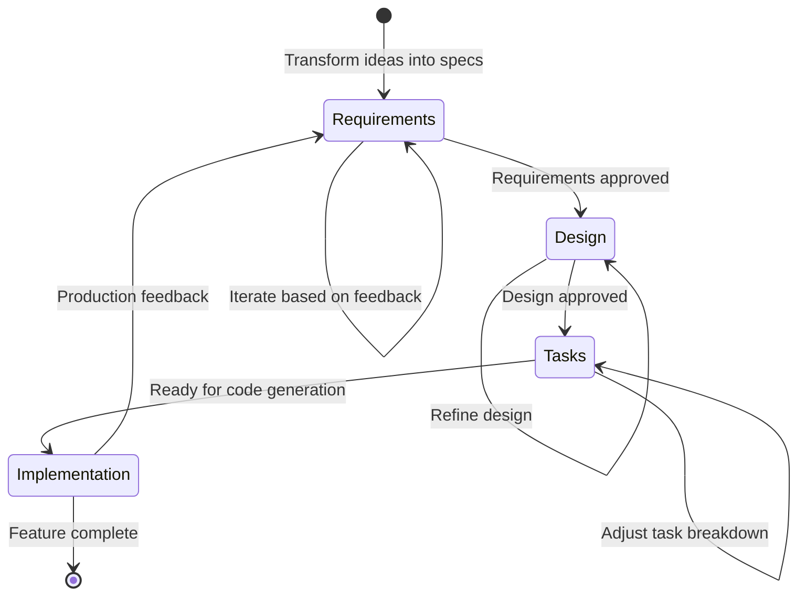

# Specification-Driven Development (SDD) Overview

<!-- Navigation Metadata -->
<!-- Section: Methodology | Level: Overview | Prerequisites: None -->
<!-- Related: process/README.md, examples/simple-feature-spec.md, prompting/README.md -->

## Quick Navigation

- **Next Step:** [Process Guide](process/README.md) - Learn the step-by-step workflow
- **See Examples:** [Simple Feature Specs](examples/simple-feature-spec.md) - See methodology in action
- **Get Started:** [Requirements Template](templates/requirements-template.md) - Start your first spec

---

## The Power Inversion

For decades, code has been king. Specifications served code—they were the scaffolding we built and then discarded once the "real work" of coding began. We wrote PRDs to guide development, created design docs to inform implementation, drew diagrams to visualize architecture. But these were always subordinate to the code itself. Code was truth. Everything else was, at best, good intentions.

**Specification-Driven Development (SDD) inverts this power structure.** Specifications don't serve code—code serves specifications. The Product Requirements Document isn't a guide for implementation; it's the source that generates implementation. Technical plans aren't documents that inform coding; they're precise definitions that produce code.

This isn't an incremental improvement to how we build software. It's a fundamental rethinking of what drives development. The gap between specification and implementation has plagued software development since its inception. SDD eliminates the gap by making specifications and their concrete implementation plans executable. When specifications generate code, there is no gap—only transformation.

## What is Specification-Driven Development?

SDD is a systematic methodology that treats specifications as executable artifacts rather than static documents. It combines the rigor of comprehensive planning with the power of AI-assisted code generation to create a new paradigm where specifications become the primary development asset.

### Core Principles

**Specifications as the Lingua Franca**: The specification becomes the primary artifact. Code becomes its expression in a particular language and framework. Maintaining software means evolving specifications.

**Executable Specifications**: Specifications must be precise, complete, and unambiguous enough to generate working systems. This eliminates the gap between intent and implementation.

**Continuous Refinement**: Consistency validation happens continuously, not as a one-time gate. AI analyzes specifications for ambiguity, contradictions, and gaps as an ongoing process.

**Research-Driven Context**: Research agents gather critical context throughout the specification process, investigating technical options, performance implications, and organizational constraints.

**Bidirectional Feedback**: Production reality informs specification evolution. Metrics, incidents, and operational learnings become inputs for specification refinement.

**Branching for Exploration**: Generate multiple implementation approaches from the same specification to explore different optimization targets—performance, maintainability, user experience, cost.

### The Three-Phase Workflow

1. **[Requirements Specification](process/01-requirements-phase.md)**: Transform vague ideas into clear, testable requirements using structured templates and AI-assisted refinement
2. **[Technical Design](process/02-design-phase.md)**: Create comprehensive technical plans that map requirements to architectural decisions
3. **[Task Planning](process/03-tasks-phase.md)**: Break down designs into actionable, sequential implementation steps that can drive code generation

Each phase builds upon the previous one, creating specifications precise enough to generate working systems.

## Why SDD Matters Now

Three convergent trends make SDD not just possible but necessary:

### AI Capability Threshold
AI capabilities have reached a point where natural language specifications can reliably generate working code. This isn't about replacing developers—it's about amplifying their effectiveness by automating the mechanical translation from specification to implementation while enhancing exploration and creativity.

### Exponential Complexity Growth
Modern systems integrate dozens of services, frameworks, and dependencies. Keeping all these pieces aligned with original intent through manual processes becomes increasingly difficult. SDD provides systematic alignment through specification-driven generation.

### Accelerating Change Pace
Requirements change far more rapidly today than ever before. Pivoting is no longer exceptional—it's expected. SDD transforms requirement changes from obstacles into normal workflow. When specifications drive implementation, pivots become systematic regenerations rather than manual rewrites.

## Core Philosophy

### Clarity Before Code
The fundamental principle is that clarity of thought and purpose must precede implementation. By investing time in understanding requirements, designing solutions, and planning implementation, we reduce uncertainty, minimize rework, and increase the likelihood of building the right thing correctly.

### Intent-Driven Development
The intent of the development team is expressed in natural language, design assets, core principles and other guidelines. The lingua franca of development moves to a higher level, with code as the last-mile implementation approach.

### Iterative Refinement
Each phase is designed to be iterative. Rather than moving linearly from idea to implementation, the methodology encourages refinement and validation at each step. This approach catches issues early when they're less expensive to fix.

### Documentation as Communication
Specifications serve as more than planning documents—they're communication tools that align stakeholders, preserve decision rationale, and provide context for future maintenance and enhancement.

## Benefits of Specification-Driven Development

### Amplified Developer Effectiveness
SDD amplifies human capability by automating mechanical translation from specification to implementation. Developers focus on creativity, experimentation, and critical thinking while AI handles routine coding tasks.

### Systematic Quality Assurance
Features developed through SDD are more robust and maintainable. The emphasis on executable specifications leads to better architectural decisions, comprehensive testing, and systematic validation of requirements.

### Rapid Adaptation to Change
When specifications drive implementation, requirement changes become systematic regenerations rather than manual rewrites. This enables maintaining engineering velocity through inevitable business pivots and market changes.

### Enhanced Collaboration
Specifications provide a common language among team members, stakeholders, and future maintainers. This improved communication reduces misunderstandings and enables more effective collaboration across disciplines.

### Knowledge Preservation and Reuse
Specifications serve as living documentation that preserves reasoning behind design decisions and implementation approaches. This knowledge remains accessible and can inform future development cycles.

## Comparison with Other Development Methodologies

### Agile Development
**Similarities**: Both value working software, customer collaboration, and embrace iterative refinement.

**Key Differences**: SDD places greater emphasis on upfront specification while working within agile frameworks. It can be applied to individual features within agile sprints, providing the structured context that AI development tools need while maintaining agile velocity.

### Test-Driven Development (TDD)
**Similarities**: Both emphasize defining success criteria before implementation and use iterative cycles.

**Key Differences**: SDD operates at a higher abstraction level, including business requirements and system design beyond just test cases. It can incorporate TDD practices within the implementation phase while providing broader context.

### Traditional Waterfall Development
**Similarities**: Both emphasize upfront planning and follow sequential phases.

**Key Differences**: SDD is iterative within each phase, treats specifications as living documents, and is optimized for feature-level development with AI assistance rather than entire project waterfalls.

### Design-First Development
**Similarities**: Both prioritize design and planning before coding.

**Key Differences**: SDD includes explicit requirements gathering, structured task breakdown, and is specifically designed for AI-assisted workflows that can generate implementation from specifications.

## When to Use Specification-Driven Development

### Decision Framework

**Use Full SDD When**:

- Building features with multiple components or integrations
- Working on high-stakes projects where failure is costly  
- Coordinating work across multiple developers or teams
- Using AI tools that benefit from structured context
- Requirements are complex or likely to change
- Need to maintain architectural consistency across implementations

**Skip SDD When**:

- Making simple bug fixes or minor tweaks
- Building experimental prototypes for learning
- Handling time-critical hotfixes
- Implementing well-established, repetitive patterns

### Key Considerations

- **Complexity**: How many moving parts and integrations are involved?
- **AI Integration**: Will AI tools be generating significant portions of the implementation?
- **Change Velocity**: How rapidly are requirements likely to evolve?
- **Team Coordination**: How many people need to understand and contribute to the work?
- **Risk Tolerance**: What's the cost of architectural inconsistency or requirement misunderstanding?

## Implementation Approaches

Today, practicing SDD requires assembling existing tools and maintaining discipline throughout the process. The methodology can be practiced with:

- AI assistants for iterative specification development
- Research agents for gathering technical context  
- Code generation tools for translating specifications to implementation
- Version control systems adapted for specification-first workflows
- Consistency checking through AI analysis of specification documents

The key is treating specifications as the source of truth, with code as the generated output that serves the specification rather than the other way around.

## Integration with Existing Workflows

SDD is designed to complement existing development methodologies:

- **Agile Sprints**: Use SDD for larger user stories or epics within sprint planning
- **Feature Branches**: Create specifications before starting feature development
- **Code Reviews**: Use specifications as context for reviewing AI-generated implementations  
- **CI/CD Pipelines**: Integrate specification validation into automated workflows
- **Documentation Systems**: Specifications become living documentation that evolves with the system

---

## Getting Started with SDD

Ready to implement specification-driven development? Here's your path forward:

### 1. Start with a Pilot Feature
Choose a medium-complexity feature for your first specification—complex enough to benefit from structured planning, but not so complex that it becomes overwhelming.

### 2. Use the Three-Phase Process
- **Requirements**: Begin with our [Requirements Template](templates/requirements-template.md)
- **Design**: Work through the [Design Documentation](process/README.md) phase
- **Tasks**: Create detailed [Implementation Plans](process/README.md) for code generation

### 3. Learn from Examples
Study our [example specifications](examples/simple-feature-spec.md) to see the methodology in action and understand the expected quality and detail level.

### 4. Adapt and Scale
Start with individual features, then expand to:

- Multiple related features
- Cross-team coordination
- Organizational architectural standards
- Automated specification validation

### 5. Build the Feedback Loop
Establish processes for:

- Specification review and approval
- Implementation validation against specifications
- Production feedback into specification evolution
- Continuous improvement of your SDD practice

The transformation from traditional development to SDD isn't about replacing developers—it's about amplifying human capability by automating mechanical translation while focusing human creativity on the problems that matter most.

**Ready to begin?** Start with the [Process Guide](process/README.md) for a detailed walkthrough of the three-phase workflow.