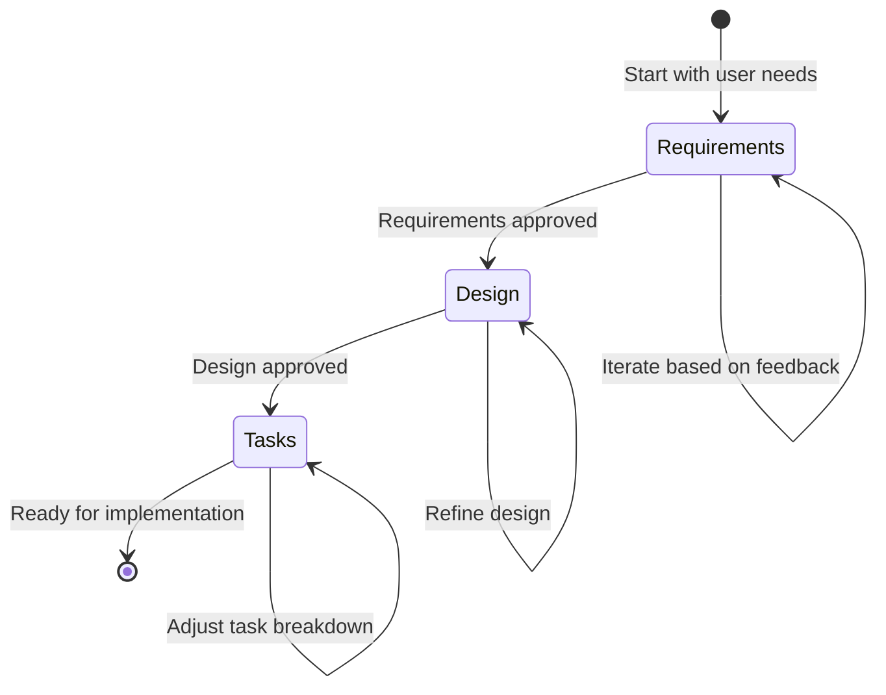

# Spec-Driven Development

<!-- Navigation Metadata -->
<!-- Section: Methodology | Level: Overview | Prerequisites: None -->
<!-- Related: process/README.md, examples/simple-feature-spec.md, prompting/README.md -->

## Quick Navigation

- **Next Step:** [Process Guide](process/README.md) - Learn the step-by-step workflow
- **See Examples:** [Simple Feature Specs](examples/simple-feature-spec.md) - See methodology in action
- **Get Started:** [Requirements Template](templates/requirements-template.md) - Start your first spec

---

## Table of Contents

1. [What is Spec-Driven Development?](#what-is-spec-driven-development)
2. [Core Philosophy](#core-philosophy)
3. [Benefits of Spec-Driven Development](#benefits-of-spec-driven-development)
4. [When to Use Spec-Driven Development](#when-to-use-spec-driven-development)
5. [Comparison with Other Methodologies](#comparison-with-other-development-methodologies)
6. [Integration with Existing Workflows](#integration-with-existing-workflows)
7. [Getting Started](#getting-started)

## What is Spec-Driven Development?

Spec-driven development is a systematic approach to software feature development that emphasizes thorough planning, clear documentation, and structured implementation. It represents a balanced methodology that combines the benefits of comprehensive upfront planning with the flexibility needed for modern software development.

### Key Characteristics

- **Structured Planning**: Features are developed through a deliberate three-phase process
- **Living Documentation**: Specifications evolve and serve as ongoing communication tools
- **AI-Optimized**: Designed to work seamlessly with AI-assisted development workflows
- **Quality-Focused**: Emphasizes building the right thing correctly from the start
- **Collaborative**: Facilitates better communication among team members and stakeholders

### The Problem It Solves

Traditional development approaches often suffer from:

- Unclear requirements leading to scope creep and rework
- Technical debt from rushed implementation decisions
- Poor communication between stakeholders and developers
- Difficulty maintaining and extending features over time
- Inefficient use of AI development tools due to lack of context

Spec-driven development addresses these challenges by transforming rough feature ideas into well-defined, implementable solutions through a process that ensures quality, maintainability, and successful delivery.

### Why It Works

The methodology is particularly powerful when combined with AI-assisted development tools, as the structured approach to requirements, design, and task planning provides the clear context that AI systems need to be most effective. By following this approach, development teams can build better software more efficiently while maintaining the agility needed to respond to changing requirements and emerging opportunities.

### At a Glance: The Three Phases

1. **Requirements Gathering**: Transform vague ideas into clear, testable requirements
2. **Design Documentation**: Create comprehensive technical plans for implementation  
3. **Task Planning**: Break down designs into actionable, sequential implementation steps

Each phase builds upon the previous one, creating a solid foundation for successful feature development.

Refer to [Process Guide](process/README.md) for step-by-step walkthrough of the three phases.

## Core Philosophy

### Clarity Before Code

The fundamental principle of spec-driven development is that clarity of thought and purpose must precede implementation. By investing time in understanding requirements, designing solutions, and planning implementation, we reduce uncertainty, minimize rework, and increase the likelihood of building the right thing correctly.

### Iterative Refinement

Each phase of the spec process is designed to be iterative. Rather than moving linearly from idea to implementation, the methodology encourages refinement and validation at each step. This approach catches issues early when they're less expensive to fix and ensures that each phase builds solidly on the previous one.

### Documentation as Communication

Specifications serve as more than just planning documents—they're communication tools that align stakeholders, preserve decision rationale, and provide context for future maintenance and enhancement. Well-written specs become valuable assets that outlive the initial implementation.

## Benefits of Spec-Driven Development

### Reduced Risk and Uncertainty

By thoroughly planning before implementation, spec-driven development significantly reduces the risk of building the wrong thing or encountering unexpected technical challenges. The systematic approach helps identify and address issues early in the process.

### Improved Quality and Maintainability

Features developed through the spec process tend to be more robust, well-tested, and maintainable. The emphasis on clear requirements and thoughtful design leads to better architectural decisions and more comprehensive testing.

### Enhanced Collaboration

Specs provide a common language and shared understanding among team members, stakeholders, and future maintainers. This improved communication reduces misunderstandings and enables more effective collaboration.

### Better Estimation and Planning

The detailed planning inherent in spec-driven development enables more accurate time and resource estimation. Project managers and developers can make better decisions about scope, timeline, and resource allocation.

### Knowledge Preservation

Specs serve as living documentation that preserves the reasoning behind design decisions, requirements rationale, and implementation approaches. This knowledge remains accessible long after the original developers have moved on.

## Comparison with Other Development Methodologies

### Traditional Waterfall Development

**Similarities**:

- Both emphasize upfront planning and documentation
- Both follow a sequential phase approach

**Key Differences**:

- Spec-driven development is more iterative within each phase
- Specs are designed to be living documents that evolve
- The methodology is optimized for feature-level development rather than entire projects
- Greater emphasis on AI-assisted development and collaboration

### Agile Development

**Similarities**:

- Both value working software and customer collaboration
- Both embrace iterative refinement and feedback

**Key Differences**:

- Spec-driven development places greater emphasis on upfront design
- More structured documentation requirements
- Designed to work within agile frameworks rather than replace them
- Can be applied to individual features within agile sprints

### Test-Driven Development (TDD)

**Similarities**:

- Both emphasize defining success criteria before implementation
- Both use an iterative red-green-refactor cycle (requirements-design-implementation)

**Key Differences**:

- Spec-driven development operates at a higher level of abstraction
- Includes business requirements and system design, not just test cases
- Can incorporate TDD practices within the implementation phase
- Provides broader context beyond just testing

### Design-First Development

**Similarities**:

- Both prioritize design and planning before coding
- Both create detailed technical specifications

**Key Differences**:

- Spec-driven development includes explicit requirements gathering
- More structured approach to task breakdown and implementation planning
- Designed specifically for AI-assisted development workflows
- Includes specific methodologies like EARS for requirements

## When to Use Spec-Driven Development

[When to Use Specs](when-to-use.md) - Decision framework for specification

### Decision Framework Summary

Use this framework to determine if spec-driven development is right for your project:

**✅ Use Full Specs When:**

- Building features with multiple components or integrations
- Working on high-stakes projects where failure is costly
- Coordinating work across multiple developers or teams
- Documentation and knowledge preservation are critical
- Using AI tools that benefit from structured context
- Requirements are complex or likely to change

**⚡ Use Lightweight Specs When:**

- Feature is moderately complex but well-understood
- Working with familiar technology patterns
- Time constraints require faster delivery
- Team is small and communication is easy

**❌ Skip Specs When:**

- Making simple bug fixes or minor tweaks
- Building experimental prototypes for learning
- Handling time-critical hotfixes
- Implementing well-established, repetitive patterns
- Working alone on personal projects

### Making the Right Choice

Consider these factors when deciding on your approach:

- **Complexity**: How many moving parts are involved?
- **Risk**: What's the cost of getting it wrong?
- **Collaboration**: How many people need to understand the work?
- **Timeline**: How much time do you have for planning?
- **Knowledge**: How well-understood is the problem domain?

## Integration with Existing Workflows

Spec-driven development is designed to complement, not replace, existing development methodologies. It can be integrated into:

- **Agile Sprints**: Use specs for larger user stories or epics
- **Feature Branches**: Create specs before starting feature development
- **Code Reviews**: Use specs as context for reviewing implementations
- **Documentation Systems**: Integrate specs into existing documentation workflows

## Getting Started

Ready to implement spec-driven development in your workflow? Here's how to begin:

1. **Start Small**: Choose a medium-complexity feature for your first spec
2. **Use the Templates**: Begin with our [Requirements Template](templates/requirements-template.md)
3. **Follow the Process**: Work through the [three-phase workflow](process/README.md)
4. **Learn from Examples**: Study our [example specifications](examples/simple-feature-spec.md)
5. **Adapt and Iterate**: Customize the methodology to fit your team's needs

The key to success with spec-driven development is consistent application and continuous refinement of your approach based on what works best for your team and projects.