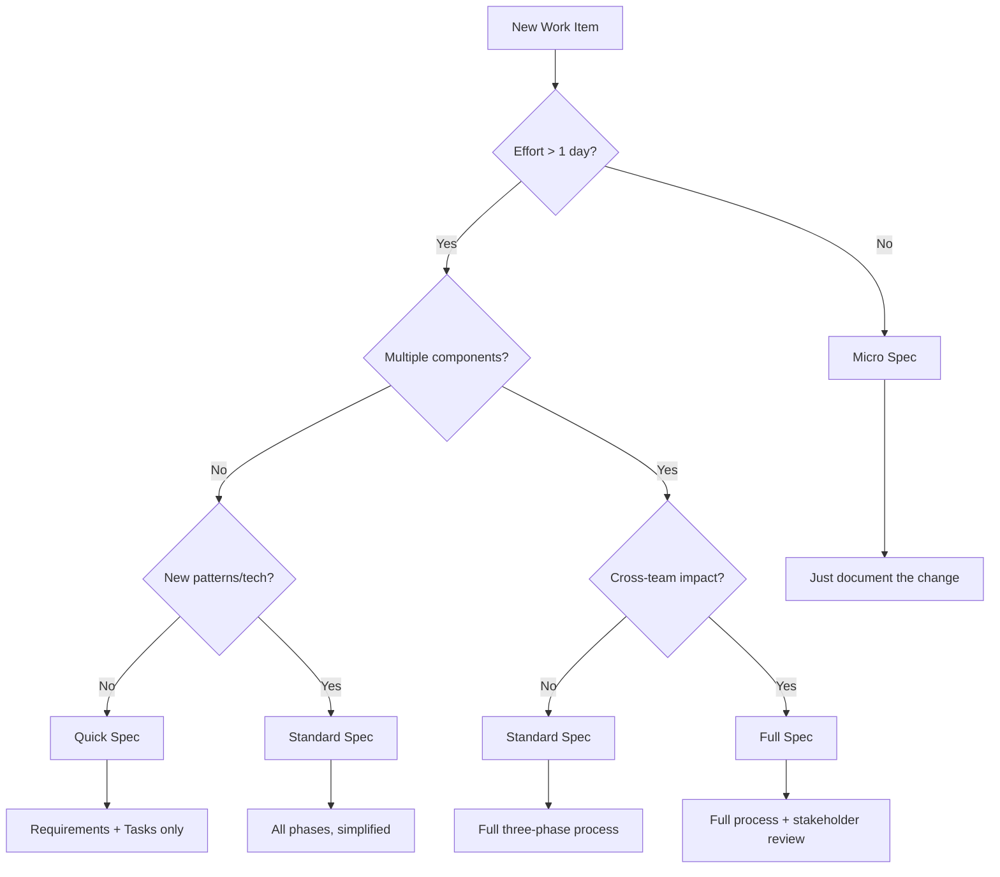

# Lightweight Specs

<!-- Navigation Metadata -->
<!-- Section: Methodology | Level: Practical | Prerequisites: when-to-use.md -->
<!-- Related: templates/quick-spec-template.md, examples/simple-feature-spec.md -->

## Quick Navigation

- **Prerequisites:** [When to Use Specs](when-to-use.md)
- **Templates:** [Quick Spec Template](templates/quick-spec-template.md)
- **Full Examples:** [Simple Feature Specs](examples/simple-feature-spec.md)

---

Streamlined spec process for small features, bug fixes, and rapid iterations.

## Overview

Not every change needs a full three-phase spec. This guide helps you choose the right level of specification based on complexity, risk, and impact.

## Spec Complexity Decision Tree



## Spec Types

### 1. Micro Spec (< 1 day effort)
**Use for:**

- Bug fixes
- Copy changes
- Configuration updates
- Minor UI tweaks

**Format:**
```markdown
# [Brief Description]

**What:** One sentence describing the change
**Why:** Brief justification
**How:** 2-3 bullet points of implementation steps
**Acceptance:** Simple pass/fail criteria
```

**Example:**
```markdown
# Fix Login Button Color

**What:** Change login button from blue to green to match brand guidelines
**Why:** Brand consistency requirement from design team
**How:** 

- Update CSS variable `--primary-button-color` to `#28a745`
- Verify color meets accessibility contrast requirements
**Acceptance:** Login button displays green and passes WCAG AA contrast test
```

### 2. Quick Spec (1-3 days effort)
**Use for:**

- Small features
- API endpoint additions
- Database schema changes
- Component modifications

**Format:**

- **Requirements:** 2-3 user stories in simplified format
- **Tasks:** Direct implementation steps (skip design phase)
- **Acceptance:** Clear success criteria

**Template:**
```markdown
# [Feature Name] - Quick Spec

## Requirements
**As a** [user type]
**I want** [capability]
**So that** [benefit]

**Acceptance Criteria:**

- [ ] [Specific, testable criterion]
- [ ] [Another criterion]

## Implementation Tasks

1. [Specific coding task with estimated time]
2. [Another task]
3. [Testing/validation task]

## Definition of Done

- [ ] Code complete and reviewed
- [ ] Tests passing
- [ ] Acceptance criteria verified
```

### 3. Standard Spec (3-10 days effort)
**Use for:**
- Medium features
- New integrations
- Performance improvements
- Security enhancements

**Format:**
- **Requirements:** Full EARS format but fewer stories
- **Design:** Simplified architecture overview
- **Tasks:** Detailed implementation plan

### 4. Full Spec (> 10 days effort)
**Use for:**
- Major features
- System redesigns
- Cross-team initiatives
- High-risk changes

**Format:** Complete three-phase process as described in main guide

## Lightweight Requirements Formats

### Simplified User Stories
Instead of full EARS format, use:
```markdown
**Story:** As [user], I want [goal] so that [benefit]
**Given** [context]
**When** [action]
**Then** [outcome]
```

### Acceptance Criteria Shortcuts
- **Happy Path:** What should work normally
- **Edge Cases:** 1-2 most likely edge cases
- **Error Handling:** How failures are handled

### Non-Functional Requirements
Quick checklist format:
- [ ] Performance: [specific requirement]
- [ ] Security: [specific requirement]
- [ ] Accessibility: [specific requirement]
- [ ] Browser Support: [specific requirement]

## Quick Design Patterns

### Component Changes
```markdown
## Design Overview
**Existing:** [Current component behavior]
**Changes:** [What will be different]
**Dependencies:** [What this affects]
**Risks:** [Potential issues]
```

### API Changes
```markdown
## API Design
**Endpoint:** [Method and path]
**Input:** [Request format]
**Output:** [Response format]
**Errors:** [Error responses]
```

### Database Changes
```markdown
## Data Changes
**Tables:** [Affected tables]
**Fields:** [New/modified fields]
**Migration:** [How to migrate existing data]
**Rollback:** [How to undo if needed]
```

## Task Breakdown Shortcuts

### Standard Task Categories
1. **Setup:** Environment, dependencies, configuration
2. **Core Logic:** Main implementation work
3. **Integration:** Connecting with existing systems
4. **Testing:** Unit tests, integration tests
5. **Documentation:** Code comments, README updates
6. **Deployment:** Release preparation

### Time Estimation Guidelines
- **Simple CRUD:** 2-4 hours per endpoint
- **UI Components:** 4-8 hours per component
- **Integration:** 1-2 days per external service
- **Testing:** 25-50% of development time
- **Documentation:** 10-20% of development time

## Quality Gates for Lightweight Specs

### Micro Spec Gates
- [ ] Change is clearly described
- [ ] Implementation approach is obvious
- [ ] Success criteria are defined

### Quick Spec Gates
- [ ] User value is articulated
- [ ] Technical approach is sound
- [ ] Effort estimate is reasonable
- [ ] Dependencies are identified

### Standard Spec Gates
- [ ] Requirements are testable
- [ ] Design addresses all requirements
- [ ] Tasks are actionable and estimated
- [ ] Risks are identified and mitigated

## Common Lightweight Patterns

### Bug Fix Pattern
```markdown
# Bug: [Brief Description]

**Issue:** [What's broken]
**Root Cause:** [Why it's broken]
**Fix:** [How to fix it]
**Test:** [How to verify the fix]
**Risk:** [What could go wrong]
```

### Feature Toggle Pattern
```markdown
# Feature: [Name] (Behind Toggle)

**Toggle:** `feature_[name]_enabled`
**Default:** `false`
**Rollout:** Gradual, starting with internal users

**Implementation:**
- [ ] Add feature toggle
- [ ] Implement feature behind toggle
- [ ] Add monitoring/metrics
- [ ] Plan rollout strategy
```

### Configuration Change Pattern
```markdown
# Config: [Description]

**Environment:** [Which environments]
**Values:** [What changes]
**Impact:** [What this affects]
**Rollback:** [How to undo]
**Validation:** [How to verify it worked]
```

## When to Upgrade Spec Complexity

### Red Flags for Micro Specs
- Implementation takes longer than expected
- Multiple files need changes
- Other developers ask clarifying questions
- Testing reveals edge cases not considered

### Red Flags for Quick Specs
- Design questions arise during implementation
- Dependencies on other teams discovered
- Performance implications become apparent
- Security review is needed

### Upgrade Process
1. **Pause Implementation:** Stop coding when complexity increases
2. **Assess Gap:** What additional specification is needed?
3. **Upgrade Spec:** Add missing requirements, design, or tasks
4. **Get Approval:** Review upgraded spec with stakeholders
5. **Resume Implementation:** Continue with better specification

## Tools and Templates

### Digital Templates
- **Micro Spec:** Single markdown section
- **Quick Spec:** GitHub issue template
- **Standard Spec:** Simplified three-phase template

### Integration Points
- **Issue Tracking:** Link specs to tickets
- **Code Reviews:** Reference spec in PR descriptions
- **Documentation:** Auto-generate from spec metadata

---

## Related Content

### Prerequisites
- [When to Use Specs](when-to-use.md) - Decision framework for specification

### Templates
- [Quick Spec Template](templates/quick-spec-template.md)
- [Micro Spec Template](templates/micro-spec-template.md)

### Examples
- [Simple Feature Examples](examples/simple-feature-spec.md)
- [Case Studies](examples/case-studies.md)

[← Back to Main Guide](../../README.md)