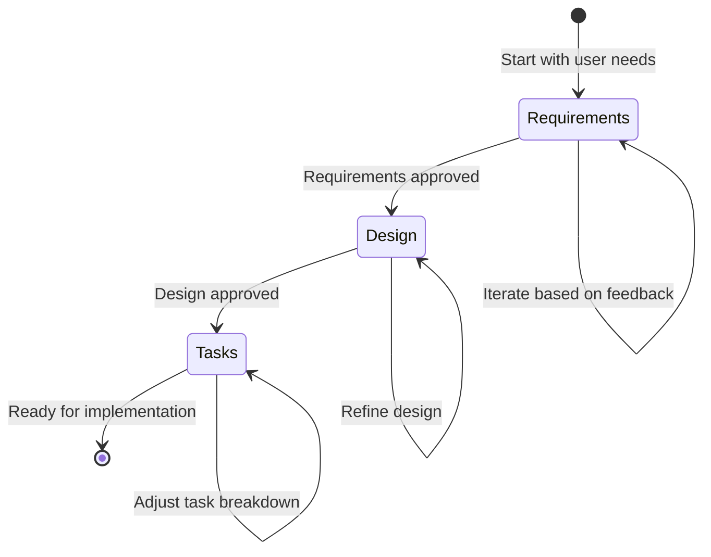

# Process Guide

<!-- Navigation Metadata -->
<!-- Section: Process | Level: Overview | Prerequisites: README.md -->
<!-- Related: templates/README.md, prompting/README.md, examples/simple-feature-spec.md -->

## Quick Navigation
- **Prerequisites:** [Methodology Overview](../README.md) - Understand the foundation first
- **Templates:** [Ready-to-Use Templates](../templates/README.md) - Get started quickly
- **Examples:** [See Complete Specs](../examples/README.md) - Learn from real examples
- **AI Help:** [Prompting Strategies](../prompting/README.md) - Collaborate effectively with AI

---

Step-by-step walkthrough of the three-phase spec-driven development workflow.

## In This Section

- **[Requirements Phase](01-requirements-phase.md)** - Gathering and structuring requirements using EARS format
- **[Design Phase](02-design-phase.md)** - Creating comprehensive design documents with research
- **[Tasks Phase](03-tasks-phase.md)** - Breaking down design into actionable coding tasks
- **[Change Management](04-change-management.md)** - Managing spec evolution and handling discovered requirements

## The Three-Phase Workflow

Each phase builds upon the previous one, with explicit approval gates to ensure quality and alignment before proceeding.

### Phase 1: [Requirements Gathering](01-requirements-phase.md)

**Purpose**: Transform vague feature ideas into clear, testable requirements

**Key Activities**:

- Capture user stories that express value and purpose
- Define acceptance criteria using EARS (Easy Approach to Requirements Syntax)
- Identify edge cases and constraints
- Validate completeness and feasibility

**Benefits**:

- Ensures all stakeholders understand what's being built
- Provides clear success criteria for implementation
- Reduces scope creep and feature drift
- Creates a foundation for testing and validation

### Phase 2: [Technical Design](02-design-phase.md)

**Purpose**: Create a comprehensive technical plan for implementation

**Key Activities**:

- Research technical approaches and constraints
- Define system architecture and component interactions
- Specify data models and interfaces
- Plan error handling and testing strategies

**Benefits**:

- Identifies technical challenges before coding begins
- Enables better estimation and resource planning
- Provides a roadmap for implementation
- Documents design decisions and their rationale

### Phase 3: [Task Planning](03-tasks-phase.md)

**Purpose**: Break down the design into actionable, sequential implementation steps

**Key Activities**:

- Convert design elements into specific coding tasks
- Sequence tasks to enable incremental progress
- Define clear objectives and completion criteria
- Reference requirements to ensure traceability

**Benefits**:

- Makes large features manageable through decomposition
- Enables parallel work and better progress tracking
- Reduces cognitive load during implementation
- Facilitates code review and quality assurance

---

## Related Content

### Prerequisites
- [Methodology Overview](../README.md) - Understand the foundation first

### Next Steps
- [Requirements Phase](01-requirements-phase.md) - Start the three-phase process
- [Templates](../templates/README.md) - Get ready-to-use starting points

### Related Sections
- [Examples](../examples/README.md) - See complete process examples
- [Prompting Strategies](../prompting/README.md) - Get better AI collaboration
- [Execution Guide](../execution/README.md) - Implement your completed specs

[← Back to Main Guide](../../README.md)