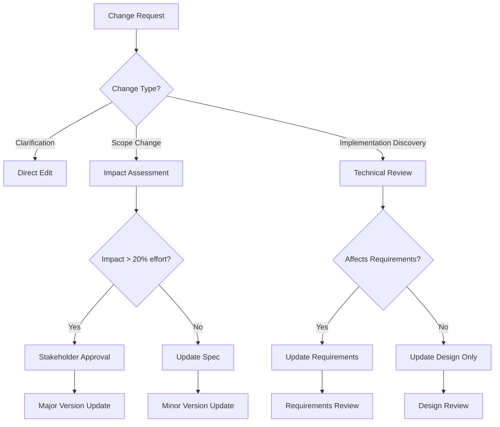

# Change Management

<!-- Navigation Metadata -->
<!-- Section: Process | Level: Advanced | Prerequisites: requirements-phase.md, design-phase.md -->
<!-- Related: execution/implementation-guide.md, templates/checklists.md -->


## Quick Navigation
- **Prerequisites:** [Requirements Phase](requirements-phase.md), [Design Phase](design-phase.md)
- **Templates:** [Checklists](../templates/checklists.md) - Change impact assessment guides
- **Execution:** [Implementation Guide](../execution/implementation-guide.md) - Handle discovered changes

---

Managing spec evolution and handling discovered requirements during implementation.

## Overview

Specs are living documents that evolve as understanding deepens. This guide covers strategies for managing changes while maintaining traceability and quality.

## Change Types

### 1. Clarification Changes
- **What:** Minor clarifications that don't affect scope
- **Examples:** Typo fixes, formatting improvements, clearer wording
- **Process:** Direct edit with commit message noting clarification

### 2. Scope Changes
- **What:** New requirements or modified existing ones
- **Examples:** Additional user stories, changed business rules
- **Process:** Full change impact assessment required

### 3. Implementation Discoveries
- **What:** Technical constraints discovered during coding
- **Examples:** API limitations, performance bottlenecks, security requirements
- **Process:** Update design phase, potentially requirements

## Change Decision Framework



## Change Impact Assessment

### Questions to Ask
1. **Requirements Impact**
   1. Does this change existing user stories?
   2. Are new acceptance criteria needed?
   3. Do any requirements become obsolete?
2. **Design Impact**
   1. What components are affected?
   2. Are new dependencies introduced?
   3. Does the architecture need revision?
3. **Implementation Impact**
   1. How many tasks need updating?
   2. What's the estimated effort change?
   3. Are there new risks or blockers?

### Impact Scoring
- **Low (1-2 points):** Clarifications, minor additions
- **Medium (3-5 points):** New features, moderate design changes
- **High (6-8 points):** Major scope changes, architecture revisions
- **Critical (9-10 points):** Fundamental requirement changes

## Change Workflow

### 1. Change Request Creation
```markdown
## Change Request: [Brief Description]

**Type:** [Clarification/Scope/Implementation Discovery]
**Requestor:** [Name/Role]
**Date:** [YYYY-MM-DD]

### Current State
[What exists now]

### Proposed Change
[What should change]

### Justification
[Why this change is needed]

### Impact Assessment

- Requirements: [None/Minor/Major]
- Design: [None/Minor/Major]
- Implementation: [None/Minor/Major]
- Effort Change: [+/- X hours/days]

### Approval Required

- [ ] Product Owner (for scope changes)
- [ ] Tech Lead (for design changes)
- [ ] Stakeholders (for major changes)
```

### 2. Review Process
1. **Technical Review:** Assess implementation feasibility
2. **Business Review:** Validate business value and priority
3. **Impact Analysis:** Calculate effort and timeline changes
4. **Approval Decision:** Go/No-go based on impact and value

### 3. Implementation
1. **Update Spec:** Modify affected sections
2. **Version Bump:** Update version according to change type
3. **Traceability:** Link changes to original requirements
4. **Communication:** Notify stakeholders of changes

## Related Content

### Prerequisites
- [Requirements Phase](requirements-phase.md) - Foundation for change management
- [Design Phase](design-phase.md) - Understanding design evolution

### Templates
- [Checklists](../templates/checklists.md) - Impact assessment guidelines

[← Back to Process Guide](README.md) | [Implementation Guide →](../execution/implementation-guide.md)