# Design Phase

<!-- Navigation Metadata -->
<!-- Phase: Design | Level: Detailed Guide | Prerequisites: requirements-phase.md -->
<!-- Related: templates/design-template.md, resources/ai-reasoning.md, examples/complex-system-spec.md -->

## Quick Navigation
- **Get Started:** [Design Template](../templates/design-template.md) - Ready-to-use template
- **See Example:** [Complex System Spec](../examples/complex-system-spec.md) - Complete design example
- **Get Help:** [Best Practices](../prompting/best-practices.md) - Effective prompting strategies
- **Next Phase:** [Tasks Phase](tasks-phase.md) - After design is approved

---

## Purpose and Goals

The Design Phase transforms approved requirements into a comprehensive technical design that serves as a blueprint for implementation. This phase involves research, architectural decisions, and detailed planning that bridges the gap between what needs to be built (requirements) and how it will be built (implementation tasks).

The design phase serves to:

- Translate requirements into technical architecture and system design
- Conduct necessary research to inform design decisions
- Define system components, interfaces, and data models
- Establish error handling and testing strategies
- Create a foundation for breaking down work into implementation tasks
- Document design rationale and decision-making process

## Step-by-Step Process

```mermaid
flowchart TD
    A["📋 Approved Requirements"] --> B["Step 1: Requirements Analysis & Research Planning"]
    B --> B1["Review Requirements Thoroughly"]
    B --> B2["Identify Technical Unknowns"]
    B --> B3["Plan Research Activities"]
    B --> B4["Set Research Boundaries"]
    
    B1 & B2 & B3 & B4 --> C["Step 2: Conduct Research & Build Context"]
    C --> C1["Gather Information"]
    C --> C2["Evaluate Options"]
    C --> C3["Document Findings"]
    C --> C4["Make Preliminary Decisions"]
    
    C1 & C2 & C3 & C4 --> D["Step 3: Create System Architecture"]
    D --> D1["System Overview"]
    D --> D2["Component Architecture"]
    D --> D3["Data Flow"]
    D --> D4["Integration Points"]
    D --> D5["Technology Stack"]
    
    D1 & D2 & D3 & D4 & D5 --> E["Step 4: Define Components & Interfaces"]
    E --> E1["Component Responsibilities"]
    E --> E2["Interface Definitions"]
    E --> E3["Dependency Relationships"]
    E --> E4["Configuration & Setup"]
    
    E1 & E2 & E3 & E4 --> F["Step 5: Design Data Models"]
    F --> F1["Entity Definitions"]
    F --> F2["Relationships"]
    F --> F3["Validation Rules"]
    F --> F4["Storage Considerations"]
    
    F1 & F2 & F3 & F4 --> G["Step 6: Plan Error Handling & Edge Cases"]
    G --> G1["Error Categories"]
    G --> G2["Error Response Strategies"]
    G --> G3["User Experience"]
    G --> G4["Recovery Mechanisms"]
    
    G1 & G2 & G3 & G4 --> H["Step 7: Define Testing Strategy"]
    H --> H1["Testing Levels"]
    H --> H2["Test Coverage"]
    H --> H3["Testing Tools"]
    H --> H4["Quality Gates"]
    
    H1 & H2 & H3 & H4 --> I["✅ Complete Design<br/>Ready for Tasks Phase"]
    
    style A fill:#e1f5fe
    style I fill:#e8f5e8
```



### Step 1: Requirements Analysis and Research Planning

**Objective**: Understand requirements deeply and identify areas needing research

**Process**:

1. **Review Requirements Thoroughly**: Understand each requirement and its implications
2. **Identify Technical Unknowns**: List areas where research is needed
3. **Plan Research Activities**: Prioritize research based on design impact
4. **Set Research Boundaries**: Define scope to avoid analysis paralysis

**Research Areas to Consider**:

- Technology stack and framework choices
- Third-party integrations and APIs
- Performance and scalability requirements
- Security and compliance considerations
- Data storage and management approaches
- User interface and experience patterns

### Step 2: Conduct Research and Build Context

**Research Process**:

1. **Gather Information**: Research technologies, patterns, and best practices
2. **Evaluate Options**: Compare different approaches and their trade-offs
3. **Document Findings**: Summarize key insights that will inform design
4. **Make Preliminary Decisions**: Choose approaches based on research

**Research Documentation Guidelines**:

- Focus on findings that impact design decisions
- Include pros/cons of different approaches
- Cite sources and include relevant links
- Summarize key insights rather than exhaustive details
- Keep research contextual to the specific requirements

### Step 3: Create System Architecture

**Architecture Components**:

1. **System Overview**: High-level description of how the system works
2. **Component Architecture**: Major system components and their relationships
3. **Data Flow**: How information moves through the system
4. **Integration Points**: External systems and APIs
5. **Technology Stack**: Chosen technologies and their rationale

**Architecture Documentation Pattern**:
```markdown
## Architecture

### System Overview
[High-level description of the system approach]

### Component Architecture
[Description of major components and their responsibilities]

### Data Flow
[How data moves through the system]

### Technology Decisions
[Key technology choices and rationale]
```

### Step 4: Define Components and Interfaces

**Component Design Elements**:

1. **Component Responsibilities**: What each component does
2. **Interface Definitions**: How components communicate
3. **Dependency Relationships**: How components depend on each other
4. **Configuration and Setup**: How components are initialized

**Interface Documentation Pattern**:
```markdown
## Components and Interfaces

### [Component Name]

- **Purpose**: [What this component does]
- **Responsibilities**: [Key functions and duties]
- **Interfaces**: [How other components interact with it]
- **Dependencies**: [What this component needs]
```

### Step 5: Design Data Models

**Data Model Elements**:

1. **Entity Definitions**: Core data structures and their properties
2. **Relationships**: How entities relate to each other
3. **Validation Rules**: Data integrity and business rules
4. **Storage Considerations**: How data will be persisted

**Data Model Documentation Pattern**:
```markdown
## Data Models

### [Entity Name]
- **Properties**: [List of fields and their types]
- **Validation**: [Rules for data integrity]
- **Relationships**: [Connections to other entities]
- **Storage**: [Persistence considerations]
```

### Step 6: Plan Error Handling and Edge Cases

**Error Handling Design**:

1. **Error Categories**: Types of errors the system might encounter
2. **Error Response Strategies**: How the system responds to different errors
3. **User Experience**: How errors are communicated to users
4. **Recovery Mechanisms**: How the system handles and recovers from errors

### Step 7: Define Testing Strategy

**Testing Strategy Elements**:

1. **Testing Levels**: Unit, integration, and end-to-end testing approaches
2. **Test Coverage**: What aspects of the system will be tested
3. **Testing Tools**: Frameworks and tools for different types of testing
4. **Quality Gates**: Criteria for determining when testing is sufficient

## Design Document Structure

### Standard Design Document Template

```markdown
# Design Document

## Overview
[High-level summary of the feature and approach]

## Architecture
[System architecture and component overview]

## Components and Interfaces
[Detailed component descriptions and interactions]

## Data Models
[Data structures and relationships]

## Error Handling
[Error scenarios and response strategies]

## Testing Strategy
[Testing approach and quality assurance]
```

### Section Guidelines

**Overview Section**:

- Provide context linking back to requirements
- Explain the overall approach and key design decisions
- Keep it concise but comprehensive enough for stakeholders

**Architecture Section**:

- Focus on the big picture and major components
- Explain how the system addresses the requirements
- Include diagrams when helpful (Mermaid syntax recommended)

**Components Section**:

- Detail each major component's purpose and responsibilities
- Define clear interfaces between components
- Explain how components work together

**Data Models Section**:

- Define all data structures used by the system
- Include validation rules and business logic
- Show relationships between different data entities

**Error Handling Section**:

- Cover both technical errors and business rule violations
- Define user-facing error messages and system responses
- Plan for graceful degradation and recovery

**Testing Strategy Section**:

- Outline testing approach for different system layers
- Define what constitutes adequate test coverage
- Specify testing tools and frameworks

## Examples of Design Patterns and Decisions

### Example 1: API Design Decision

**Context**: Need to design REST API for user management

**Options Considered**:
1. **RESTful with standard HTTP methods**
   1. Pros: Standard, well-understood, good tooling support
   2. Cons: May not fit all operations perfectly
2. **GraphQL API**
   1. Pros: Flexible queries, single endpoint
   2. Cons: Additional complexity, learning curve
3. **RPC-style API**
   1. Pros: Direct mapping to business operations
   2. Cons: Less standard, harder to cache

**Decision**: RESTful API with standard HTTP methods
**Rationale**: Requirements indicate standard CRUD operations, team familiarity with REST, good ecosystem support

### Example 2: Data Storage Decision

**Context**: Need to store user profiles and preferences

**Options Considered**:
1. **Relational Database (PostgreSQL)**
   - Pros: ACID compliance, complex queries, mature ecosystem
   - Cons: Schema rigidity, scaling complexity
2. **Document Database (MongoDB)**
   - Pros: Schema flexibility, easy scaling
   - Cons: Eventual consistency, less mature tooling
3. **Key-Value Store (Redis)**
   - Pros: High performance, simple operations
   - Cons: Limited query capabilities, memory constraints

**Decision**: PostgreSQL with JSON columns for flexible data
**Rationale**: Need for data consistency, complex relationships, with flexibility for user preferences

### Example 3: Authentication Strategy

**Context**: Need secure user authentication

**Options Considered**:
1. **Session-based authentication**
   1. Pros: Simple, server-controlled, secure
   2. Cons: Scalability challenges, state management
2. **JWT tokens**
   1. Pros: Stateless, scalable, cross-domain support
   2. Cons: Token revocation complexity, size limitations
3. **OAuth 2.0 with external provider**
   1. Pros: No password management, user convenience
   2. Cons: External dependency, limited customization

**Decision**: JWT tokens with refresh token rotation
**Rationale**: Scalability requirements, API-first architecture, security best practices

## Quality Checklist

Before moving to the tasks phase, verify:

**Completeness**:

- [ ] All requirements are addressed in the design
- [ ] Major system components are defined
- [ ] Data models cover all necessary entities
- [ ] Error handling covers expected failure modes
- [ ] Testing strategy addresses all system layers

**Clarity**:

- [ ] Design decisions are clearly explained
- [ ] Component responsibilities are well-defined
- [ ] Interfaces between components are specified
- [ ] Technical choices include rationale

**Feasibility**:

- [ ] Design is technically achievable with chosen technologies
- [ ] Performance requirements can be met
- [ ] Security requirements are addressed
- [ ] Implementation complexity is reasonable

**Traceability**:

- [ ] Design elements map back to specific requirements
- [ ] All requirements are covered by design components
- [ ] Design decisions support requirement fulfillment
- [ ] Testing strategy validates requirement satisfaction

## Common Design Pitfalls

### Pitfall 1: Over-Engineering
- **Problem**: Designing for requirements that don't exist
- **Solution**: Focus on current requirements, design for extensibility but don't implement unused features

### Pitfall 2: Under-Specified Interfaces
- **Problem**: Vague component boundaries and interactions
- **Solution**: Clearly define what each component does and how components communicate

### Pitfall 3: Ignoring Non-Functional Requirements
- **Problem**: Focusing only on functional behavior
- **Solution**: Address performance, security, scalability, and maintainability explicitly

### Pitfall 4: Technology-First Design
- **Problem**: Choosing technologies before understanding requirements
- **Solution**: Let requirements drive technology choices, not the reverse

### Pitfall 5: Insufficient Error Handling Design
- **Problem**: Only designing for happy path scenarios
- **Solution**: Explicitly design error handling and edge case behavior

## Troubleshooting Design Issues

### Issue: Design Becomes Too Complex
- **Symptoms**: Design document is overwhelming, too many components
- **Solution**: Simplify by focusing on core requirements, consider phased implementation

### Issue: Requirements Don't Map to Design
- **Symptoms**: Difficulty tracing requirements to design elements
- **Solution**: Review each requirement and ensure it's addressed in the design

### Issue: Technology Choices Are Unclear
- **Symptoms**: Multiple viable options without clear selection criteria
- **Solution**: Define decision criteria based on requirements and constraints

### Issue: Design Lacks Detail for Implementation
- **Symptoms**: Developers can't start coding from the design
- **Solution**: Add more specific component descriptions and interface definitions

## Next Steps

Once design is complete and approved:

1. **Transition to Tasks Phase**: Break down design into actionable implementation tasks
2. **Maintain Design-Task Traceability**: Ensure tasks implement all design elements
3. **Keep Design Updated**: Update design if task breakdown reveals issues
4. **Prepare Implementation Context**: Design serves as reference during coding

The design phase bridges requirements and implementation, providing the technical foundation for building the feature effectively.