# Workflow Diagrams and Visual Aids

This document provides visual representations of the spec-driven development process, including complete workflow diagrams, decision trees, and phase transition flows.

## Complete Process Flow

The following diagram shows the complete spec-driven development workflow from initial idea to implementation:

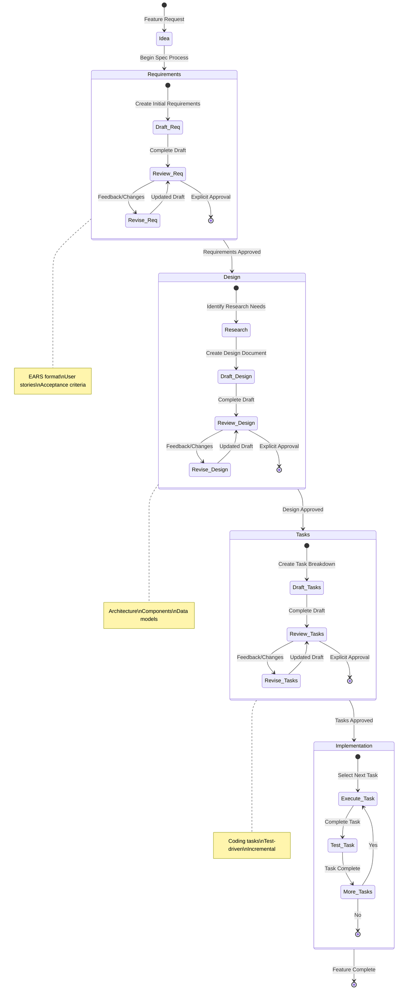

## Phase Transition Decision Tree

This decision tree helps determine when to move between phases and when to iterate:

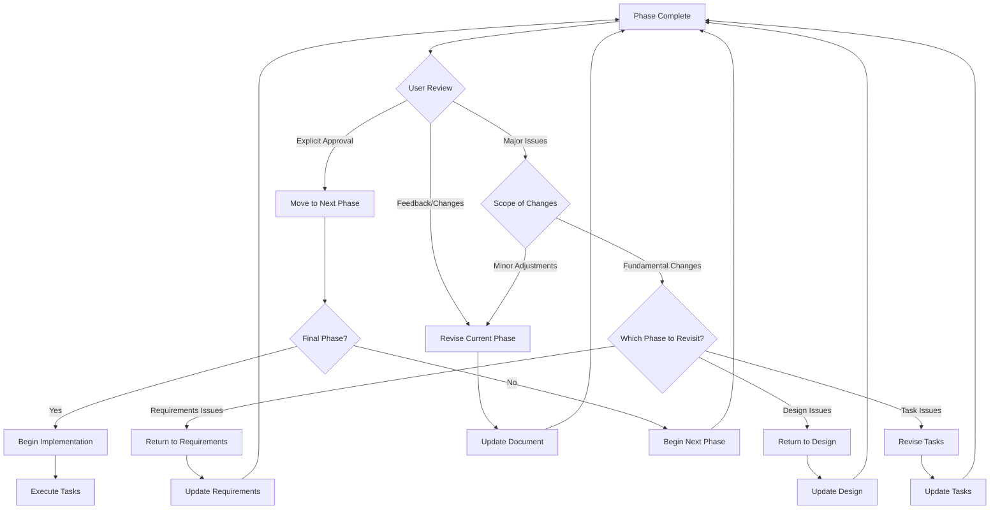

## Requirements Phase Flow

Detailed workflow for the requirements gathering phase:

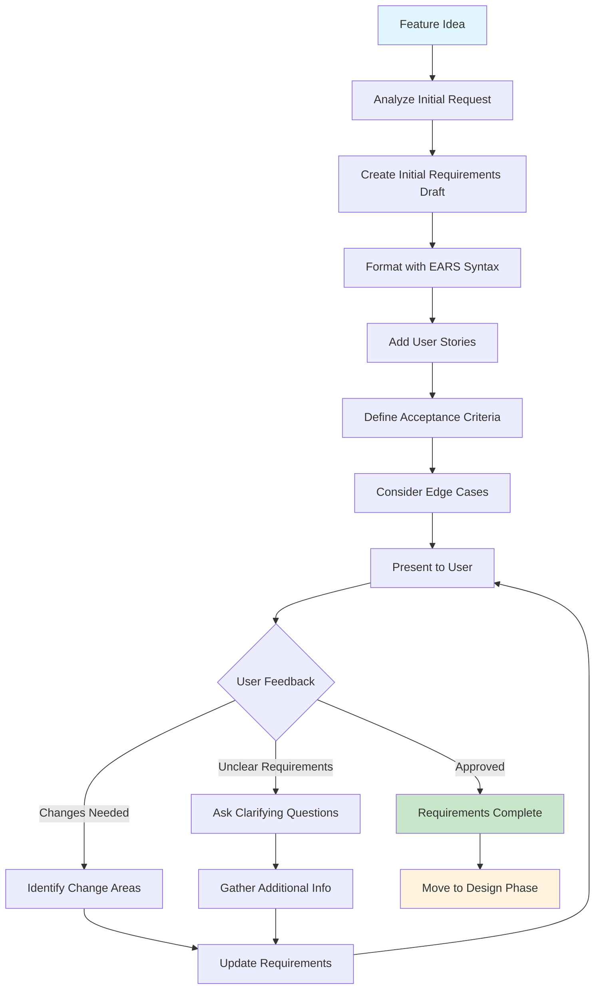

## Design Phase Flow

Detailed workflow for the design phase:

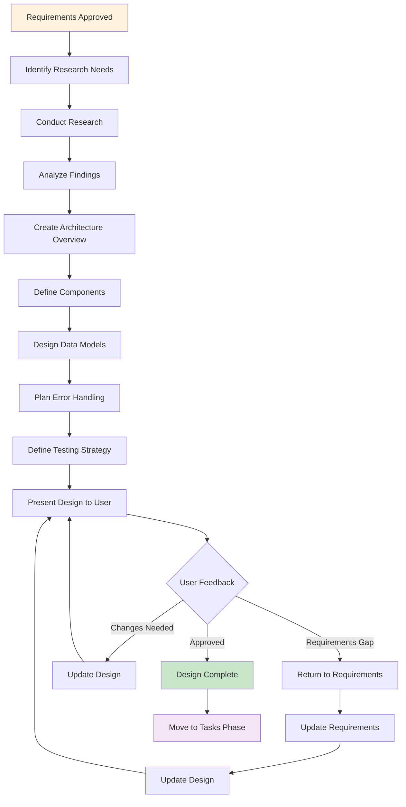

## Tasks Phase Flow

Detailed workflow for breaking down design into implementation tasks:

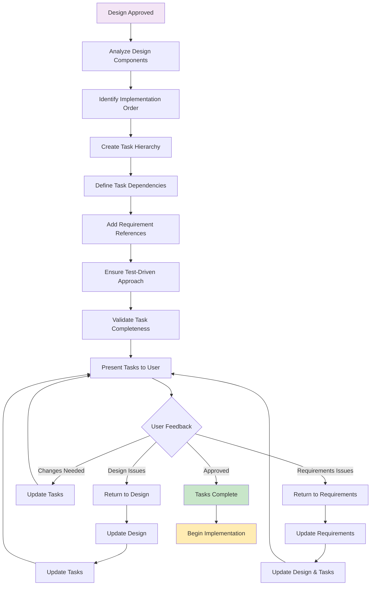

## Implementation Execution Flow

Workflow for executing individual tasks from the implementation plan:

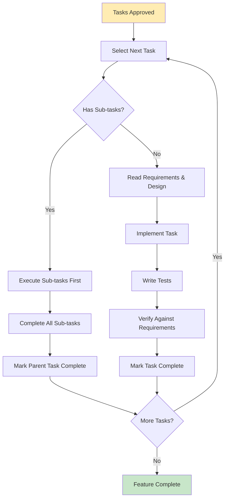

## Feedback Loop Patterns

Common patterns for handling feedback and iterations:

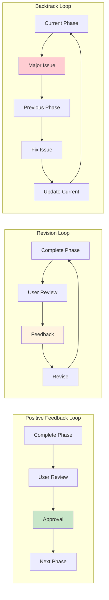

## Entry Points and Context

Different ways users can enter the spec workflow:

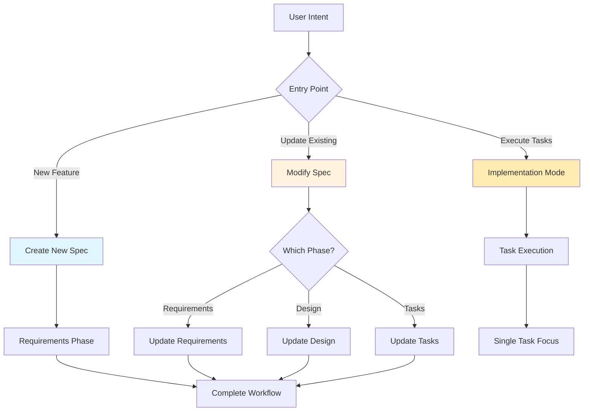

## Quality Gates and Validation Points

Key validation checkpoints throughout the process:

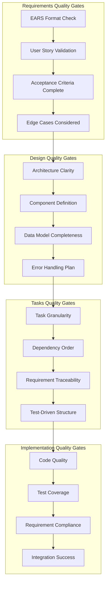

## Common Workflow Scenarios

### Scenario 1: Smooth Linear Progression
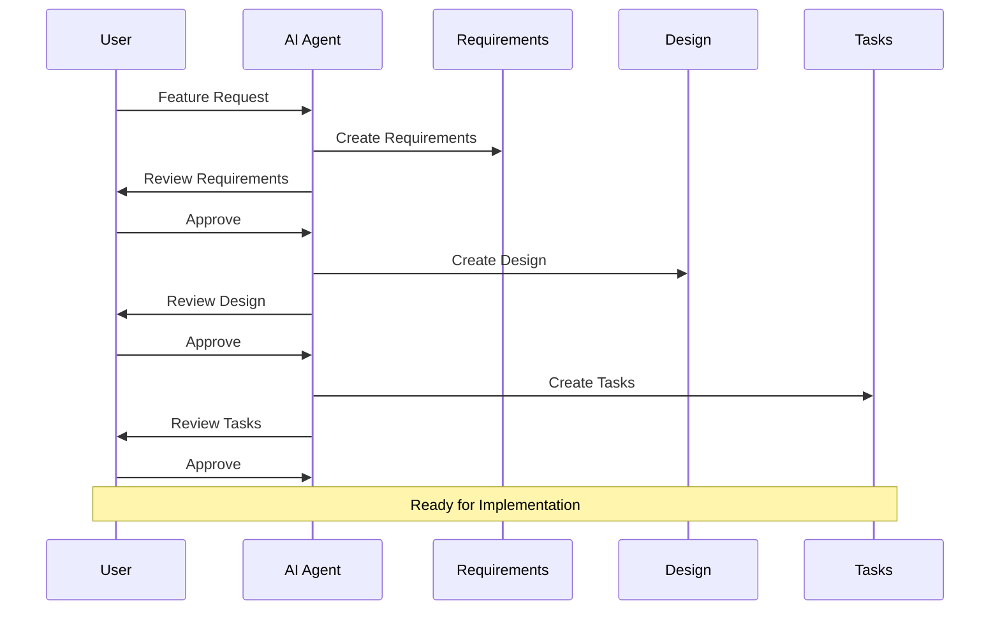

### Scenario 2: Iterative Refinement
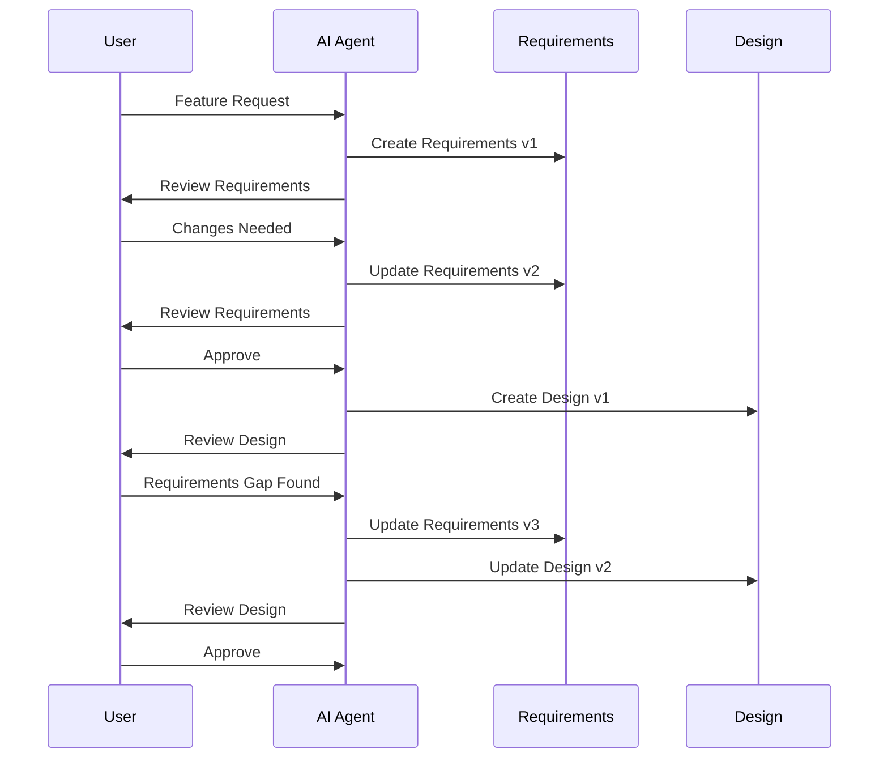

### Scenario 3: Implementation Feedback
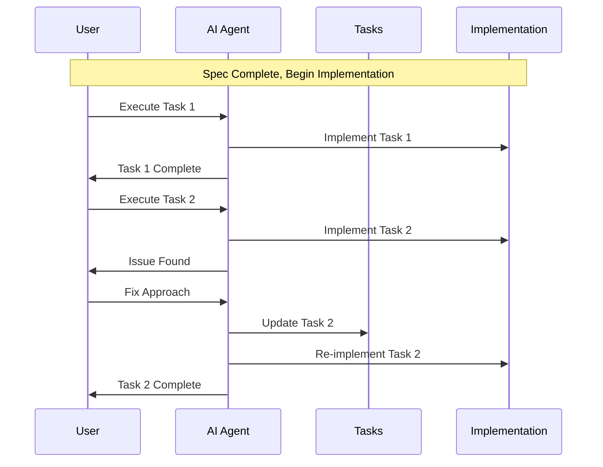

These visual aids provide comprehensive guidance for understanding and navigating the spec-driven development process, supporting both newcomers learning the methodology and experienced practitioners looking for quick reference materials.