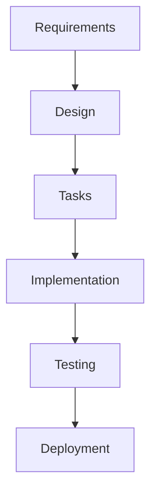

# Tools and Integration Guide

This guide provides recommendations for tools, platforms, and integrations that support the spec-driven development process.

## Documentation Tools

### Markdown Editors and Platforms

#### GitHub/GitLab
**Best for**: Version-controlled documentation, team collaboration

**Features**:
- Native Markdown rendering
- Pull request reviews for documentation
- Issue tracking integration
- Wiki functionality
- Mermaid diagram support

**Integration Tips**:
- Store specs in `.kiro/specs/` directory structure
- Use branch protection for spec reviews
- Link issues to specific requirements
- Use GitHub Pages for published documentation

#### Notion
**Best for**: Rich formatting, database integration, team wikis

**Features**:
- Rich text editing with Markdown export
- Database views for requirement tracking
- Template system for consistent formatting
- Real-time collaboration
- Integration with project management tools

**Integration Tips**:
- Create template pages for each spec phase
- Use databases to track requirement status
- Link related pages for cross-references
- Export to Markdown for version control

#### Obsidian
**Best for**: Knowledge graphs, cross-referencing, personal knowledge management

**Features**:
- Bidirectional linking between documents
- Graph view for requirement relationships
- Plugin ecosystem for extended functionality
- Local file storage with sync options
- Advanced search and filtering

**Integration Tips**:
- Use tags for requirement categorization
- Create templates for consistent structure
- Leverage graph view for dependency analysis
- Use daily notes for spec development progress

#### Confluence
**Best for**: Enterprise documentation, structured content management

**Features**:
- Enterprise-grade collaboration
- Advanced permissions and workflows
- Template system and macros
- Integration with Atlassian suite
- Advanced search and reporting

**Integration Tips**:
- Create space templates for spec projects
- Use page templates for consistent formatting
- Leverage macros for dynamic content
- Integrate with Jira for requirement tracking

### Diagramming Tools

#### Mermaid
**Best for**: Code-based diagrams, version control integration

**Supported Diagrams**:
- Flowcharts for process flows
- Sequence diagrams for interactions
- Class diagrams for data models
- State diagrams for system behavior
- Gantt charts for project timelines

**Example Usage**:


**Integration Tips**:
- Embed directly in Markdown documents
- Use consistent styling across diagrams
- Version control diagram source code
- Generate documentation from diagrams

#### Lucidchart
**Best for**: Complex system diagrams, collaborative design

**Features**:
- Professional diagramming tools
- Real-time collaboration
- Template library
- Integration with documentation platforms
- Advanced styling and formatting

**Integration Tips**:
- Create diagram templates for common patterns
- Use shared folders for team access
- Export diagrams for documentation embedding
- Link diagrams to specific requirements

#### Draw.io (now diagrams.net)
**Best for**: Free diagramming, offline capability

**Features**:
- Free and open-source
- Web-based and desktop versions
- Integration with cloud storage
- Extensive shape libraries
- Export to multiple formats

**Integration Tips**:
- Save diagrams in project repositories
- Use consistent naming conventions
- Create custom shape libraries
- Export as SVG for scalable embedding

## Project Management and Tracking

### Linear
**Best for**: Modern project management, developer-focused workflows

**Features**:
- Clean, fast interface
- Git integration
- Automated workflows
- Requirement tracking
- Sprint planning

**Spec Integration**:
- Create issues from requirements
- Link tasks to specific acceptance criteria
- Track implementation progress
- Generate reports on spec completion

**Setup Tips**:
- Create labels for spec phases (Requirements, Design, Tasks)
- Use custom fields for requirement traceability
- Set up automation for status updates
- Create views for different stakeholders

### Jira
**Best for**: Enterprise project management, complex workflows

**Features**:
- Customizable workflows
- Advanced reporting
- Integration ecosystem
- Requirement management
- Agile planning tools

**Spec Integration**:
- Create epic for each major requirement
- Break down epics into user stories
- Link stories to acceptance criteria
- Track progress through custom dashboards

**Setup Tips**:
- Create custom issue types for requirements
- Use components to organize by feature area
- Set up custom fields for EARS tracking
- Create dashboards for spec progress

### GitHub Issues/Projects
**Best for**: Code-integrated project management, open source projects

**Features**:
- Native Git integration
- Project boards and automation
- Issue templates
- Milestone tracking
- Pull request integration

**Spec Integration**:
- Create issue templates for requirements
- Use project boards for spec phases
- Link pull requests to requirements
- Track completion through milestones

**Setup Tips**:
- Create labels for requirement types
- Use issue templates for consistency
- Set up project automation rules
- Link issues to specific code changes

### Trello
**Best for**: Simple kanban boards, visual project management

**Features**:
- Visual kanban boards
- Card-based organization
- Power-ups for extended functionality
- Team collaboration
- Mobile apps

**Spec Integration**:
- Create boards for each spec phase
- Use cards for individual requirements
- Add checklists for acceptance criteria
- Move cards through workflow stages

**Setup Tips**:
- Create board templates for new specs
- Use labels for requirement priority
- Add due dates for milestone tracking
- Use power-ups for time tracking

## Requirements Management Tools

### Azure DevOps
**Best for**: Enterprise requirements management, Microsoft ecosystem

**Features**:
- Work item tracking
- Requirements hierarchy
- Traceability matrix
- Test case management
- Integration with development tools

**Spec Integration**:
- Create work item types for requirements
- Build requirement hierarchies
- Link requirements to test cases
- Generate traceability reports

### IBM DOORS
**Best for**: Regulated industries, complex requirement traceability

**Features**:
- Formal requirements management
- Change impact analysis
- Baseline management
- Compliance reporting
- Integration with testing tools

**Spec Integration**:
- Import requirements from specs
- Maintain requirement baselines
- Track requirement changes
- Generate compliance reports

### Aha!
**Best for**: Product management, roadmap planning

**Features**:
- Product roadmap management
- Feature prioritization
- Stakeholder communication
- Integration with development tools
- Strategic planning

**Spec Integration**:
- Create features from requirements
- Prioritize based on business value
- Communicate roadmap to stakeholders
- Track feature delivery

## Testing and Quality Assurance Tools

### Test Management

#### TestRail
**Best for**: Comprehensive test management, requirement traceability

**Features**:
- Test case management
- Test execution tracking
- Requirement coverage analysis
- Reporting and analytics
- Integration with bug tracking

**Spec Integration**:
- Create test cases from acceptance criteria
- Track requirement coverage
- Link test results to requirements
- Generate coverage reports

#### Zephyr
**Best for**: Jira integration, agile testing

**Features**:
- Native Jira integration
- Test case creation and execution
- Real-time reporting
- Traceability matrix
- Automation integration

**Spec Integration**:
- Link test cases to requirement issues
- Track testing progress in Jira
- Generate requirement coverage reports
- Integrate with CI/CD pipelines

### Automated Testing

#### Jest/Vitest
**Best for**: JavaScript/TypeScript unit testing

**Integration Tips**:
- Name test files to match requirements
- Use describe blocks for requirement grouping
- Include requirement IDs in test descriptions
- Generate coverage reports for requirements

#### Cypress/Playwright
**Best for**: End-to-end testing, user scenario validation

**Integration Tips**:
- Create test scenarios from user stories
- Use data attributes for requirement traceability
- Generate test reports with requirement mapping
- Integrate with CI/CD for continuous validation

#### Postman/Insomnia
**Best for**: API testing, integration validation

**Integration Tips**:
- Create test collections for API requirements
- Use environment variables for different test scenarios
- Generate API documentation from tests
- Integrate with CI/CD for automated API testing

## Development and Code Quality Tools

### Code Quality

#### SonarQube
**Best for**: Code quality analysis, technical debt management

**Features**:
- Static code analysis
- Security vulnerability detection
- Code coverage tracking
- Technical debt assessment
- Quality gate enforcement

**Spec Integration**:
- Set quality gates based on requirements
- Track code coverage for requirement implementation
- Monitor technical debt introduction
- Generate quality reports for stakeholders

#### ESLint/Prettier
**Best for**: Code formatting and linting

**Integration Tips**:
- Configure rules based on project standards
- Integrate with CI/CD for automated checks
- Use pre-commit hooks for consistency
- Generate reports for code quality metrics

### Version Control

#### Git Workflows
**Best for**: Code versioning, collaboration

**Spec Integration Strategies**:
- **Feature Branches**: Create branches for each requirement
- **Commit Messages**: Reference requirement IDs in commits
- **Pull Requests**: Link PRs to specific requirements
- **Tags**: Tag releases with requirement completion

**Branch Naming Conventions**:
- `feature/req-1.1-user-authentication`
- `bugfix/req-2.3-validation-error`
- `docs/req-update-api-spec`

## CI/CD and Automation Tools

### Continuous Integration

#### GitHub Actions
**Best for**: GitHub-integrated CI/CD, workflow automation

**Spec Integration**:
- Trigger builds on requirement-related changes
- Run tests for specific requirement areas
- Generate reports on requirement completion
- Automate deployment based on requirement status

**Example Workflow**:
```yaml
name: Requirement Validation
on:
  pull_request:
    paths:
      - 'src/requirements/**'
jobs:
  validate:
    runs-on: ubuntu-latest
    steps:
      - uses: actions/checkout@v2
      - name: Run requirement tests
        run: npm test -- --grep "Requirement"
```

#### Jenkins
**Best for**: Enterprise CI/CD, complex pipelines

**Spec Integration**:
- Create pipelines for requirement validation
- Integrate with testing tools
- Generate requirement completion reports
- Automate deployment based on quality gates

#### GitLab CI
**Best for**: GitLab-integrated CI/CD, DevOps workflows

**Spec Integration**:
- Use merge request templates for requirement reviews
- Create pipelines for requirement testing
- Generate coverage reports
- Automate requirement status updates

## Communication and Collaboration Tools

### Team Communication

#### Slack
**Best for**: Real-time team communication, integration hub

**Spec Integration**:
- Create channels for spec discussions
- Use bots for requirement status updates
- Integrate with project management tools
- Share spec progress and updates

**Bot Integrations**:
- GitHub/GitLab notifications for spec changes
- Jira/Linear updates for requirement progress
- Calendar reminders for spec reviews
- Custom bots for requirement queries

#### Microsoft Teams
**Best for**: Enterprise communication, Microsoft ecosystem

**Spec Integration**:
- Create teams for spec development
- Use channels for different spec phases
- Integrate with Azure DevOps
- Share documents and collaborate on specs

#### Discord
**Best for**: Community-driven projects, informal communication

**Spec Integration**:
- Create channels for spec discussions
- Use bots for automated updates
- Share progress and get feedback
- Coordinate development activities

### Review and Approval

#### ReviewBoard
**Best for**: Code and document review workflows

**Features**:
- Document review workflows
- Comment and approval tracking
- Integration with version control
- Review analytics and reporting

**Spec Integration**:
- Review requirements documents
- Track approval status
- Manage review feedback
- Generate review reports

#### Collaborator
**Best for**: Enterprise code and document review

**Features**:
- Formal review processes
- Compliance reporting
- Integration with development tools
- Advanced analytics

**Spec Integration**:
- Formal spec review processes
- Compliance tracking
- Review metrics and reporting
- Integration with quality gates

## Monitoring and Analytics Tools

### Application Monitoring

#### DataDog
**Best for**: Application performance monitoring, observability

**Spec Integration**:
- Monitor requirement-specific metrics
- Create dashboards for feature performance
- Set up alerts for requirement violations
- Track user behavior for requirement validation

#### New Relic
**Best for**: Application performance monitoring, user experience

**Spec Integration**:
- Monitor feature performance metrics
- Track user interactions with new features
- Set up alerts for performance requirements
- Generate reports on requirement compliance

### Analytics and Reporting

#### Google Analytics
**Best for**: User behavior tracking, feature usage analysis

**Spec Integration**:
- Track usage of new features
- Measure requirement success metrics
- Analyze user behavior patterns
- Generate reports on feature adoption

#### Mixpanel
**Best for**: Product analytics, event tracking

**Spec Integration**:
- Track requirement-specific events
- Measure feature success metrics
- Analyze user engagement
- Generate requirement performance reports

## Tool Integration Strategies

### Workflow Integration

#### Single Source of Truth
- Choose one primary tool for requirement storage
- Sync data between tools using APIs
- Maintain consistency across platforms
- Establish clear data ownership

#### API Integration
- Use webhooks for real-time updates
- Implement custom integrations where needed
- Leverage existing integration platforms
- Monitor integration health and performance

#### Automation Workflows
- Automate status updates across tools
- Create triggers for requirement changes
- Generate reports automatically
- Notify stakeholders of important updates

### Best Practices

#### Tool Selection Criteria
- **Team Size**: Choose tools that scale with your team
- **Budget**: Consider cost vs. value for your organization
- **Integration**: Ensure tools work well together
- **Learning Curve**: Consider adoption time and training needs
- **Support**: Evaluate vendor support and community

#### Implementation Strategy
1. **Start Small**: Begin with core tools and expand gradually
2. **Pilot Programs**: Test tools with small teams first
3. **Training**: Provide adequate training for team members
4. **Feedback**: Collect feedback and iterate on tool usage
5. **Optimization**: Continuously optimize workflows and integrations

#### Maintenance and Updates
- Regularly review tool effectiveness
- Keep integrations updated and secure
- Monitor tool usage and adoption
- Plan for tool migrations and upgrades
- Maintain documentation for tool usage

---

## Tool Comparison Matrix

| Category | Tool | Best For | Cost | Learning Curve | Integration |
|----------|------|----------|------|----------------|-------------|
| Documentation | GitHub | Version control | Free/Paid | Low | Excellent |
| Documentation | Notion | Rich formatting | Paid | Medium | Good |
| Documentation | Confluence | Enterprise | Paid | Medium | Excellent |
| Project Mgmt | Linear | Modern teams | Paid | Low | Good |
| Project Mgmt | Jira | Enterprise | Paid | High | Excellent |
| Project Mgmt | GitHub Projects | Code integration | Free/Paid | Low | Excellent |
| Diagramming | Mermaid | Code-based | Free | Medium | Excellent |
| Diagramming | Lucidchart | Professional | Paid | Low | Good |
| Testing | Jest | Unit testing | Free | Medium | Good |
| Testing | Cypress | E2E testing | Free/Paid | Medium | Good |
| CI/CD | GitHub Actions | GitHub integration | Free/Paid | Medium | Excellent |
| CI/CD | Jenkins | Enterprise | Free | High | Good |

## Recommended Tool Stacks

### Startup/Small Team Stack
**Budget**: Low to Medium  
**Team Size**: 2-10 developers  
**Complexity**: Low to Medium

**Core Tools**:
- **Documentation**: GitHub + Markdown
- **Project Management**: Linear or GitHub Projects
- **Diagramming**: Mermaid (embedded in docs)
- **Testing**: Jest + Cypress
- **CI/CD**: GitHub Actions
- **Communication**: Slack

**Total Cost**: $50-200/month  
**Setup Time**: 1-2 days  
**Learning Curve**: Low

**Pros**:
- Integrated ecosystem
- Low cost and complexity
- Fast setup and adoption
- Good for code-centric teams

**Cons**:
- Limited advanced features
- May not scale to large teams
- Fewer enterprise integrations

### Enterprise Stack
**Budget**: High  
**Team Size**: 50+ developers  
**Complexity**: High

**Core Tools**:
- **Documentation**: Confluence + SharePoint
- **Project Management**: Jira + Azure DevOps
- **Requirements**: IBM DOORS or Azure DevOps
- **Diagramming**: Lucidchart + Visio
- **Testing**: TestRail + Selenium Grid
- **CI/CD**: Jenkins + Azure Pipelines
- **Communication**: Microsoft Teams

**Total Cost**: $500-2000/month  
**Setup Time**: 2-4 weeks  
**Learning Curve**: High

**Pros**:
- Enterprise-grade features
- Advanced reporting and analytics
- Compliance and audit support
- Extensive integration options

**Cons**:
- High cost and complexity
- Longer setup and training time
- May be overkill for smaller projects

### Hybrid/Modern Stack
**Budget**: Medium  
**Team Size**: 10-50 developers  
**Complexity**: Medium

**Core Tools**:
- **Documentation**: Notion + GitHub
- **Project Management**: Linear + Jira (for complex projects)
- **Diagramming**: Mermaid + Lucidchart
- **Testing**: Jest + Playwright + TestRail
- **CI/CD**: GitHub Actions + Jenkins
- **Communication**: Slack + Microsoft Teams

**Total Cost**: $200-800/month  
**Setup Time**: 1 week  
**Learning Curve**: Medium

**Pros**:
- Balance of features and cost
- Flexible and adaptable
- Good integration options
- Scales with team growth

**Cons**:
- Requires more tool management
- Potential integration complexity
- May require custom solutions

## Tool Selection Framework

### Evaluation Criteria

#### Functional Requirements
1. **Core Features**: Does the tool provide essential functionality?
2. **Integration**: How well does it integrate with existing tools?
3. **Scalability**: Can it grow with your team and projects?
4. **Customization**: Can it be adapted to your specific needs?
5. **Reporting**: Does it provide necessary analytics and reporting?

#### Non-Functional Requirements
1. **Performance**: Is the tool fast and responsive?
2. **Reliability**: Is it stable and available when needed?
3. **Security**: Does it meet your security requirements?
4. **Usability**: Is it easy to learn and use?
5. **Support**: What level of support is available?

#### Business Considerations
1. **Cost**: Total cost of ownership including licenses, training, maintenance
2. **ROI**: Expected return on investment and productivity gains
3. **Risk**: Vendor stability, lock-in concerns, migration complexity
4. **Compliance**: Regulatory and policy compliance requirements
5. **Timeline**: Implementation timeline and resource requirements

### Decision Matrix Template

| Tool | Core Features | Integration | Scalability | Cost | Usability | Total Score |
|------|---------------|-------------|-------------|------|-----------|-------------|
| Option 1 | 8/10 | 7/10 | 9/10 | 6/10 | 8/10 | 38/50 |
| Option 2 | 9/10 | 8/10 | 7/10 | 8/10 | 7/10 | 39/50 |
| Option 3 | 7/10 | 9/10 | 8/10 | 7/10 | 9/10 | 40/50 |

### Implementation Roadmap

#### Phase 1: Foundation (Week 1-2)
- Set up core documentation platform
- Configure basic project management
- Establish team communication channels
- Create initial templates and workflows

#### Phase 2: Enhancement (Week 3-4)
- Add diagramming and visualization tools
- Implement testing and quality assurance tools
- Set up basic automation and CI/CD
- Train team on new tools and processes

#### Phase 3: Optimization (Week 5-8)
- Integrate advanced features and customizations
- Implement comprehensive monitoring and reporting
- Optimize workflows and automation
- Gather feedback and iterate on processes

#### Phase 4: Scaling (Ongoing)
- Add additional tools as needed
- Scale processes for larger teams
- Implement advanced integrations
- Continuously improve and optimize

## Integration Patterns and Best Practices

### API Integration Patterns

#### Webhook-Based Integration
```javascript
// Example: GitHub webhook to update project management tool
app.post('/webhook/github', (req, res) => {
  const { action, pull_request } = req.body;
  
  if (action === 'opened' && pull_request.title.includes('[REQ-')) {
    // Extract requirement ID from PR title
    const reqId = pull_request.title.match(/\[REQ-(\d+\.\d+)\]/)[1];
    
    // Update project management tool
    await updateTaskStatus(reqId, 'in_progress');
  }
  
  res.status(200).send('OK');
});
```

#### Polling-Based Integration
```javascript
// Example: Sync requirement status between tools
async function syncRequirementStatus() {
  const requirements = await getRequirementsFromSource();
  
  for (const req of requirements) {
    const currentStatus = await getStatusFromProjectTool(req.id);
    const expectedStatus = await getStatusFromRequirementTool(req.id);
    
    if (currentStatus !== expectedStatus) {
      await updateStatus(req.id, expectedStatus);
    }
  }
}

// Run every 15 minutes
setInterval(syncRequirementStatus, 15 * 60 * 1000);
```

#### Event-Driven Integration
```javascript
// Example: Event bus for tool integration
class SpecEventBus {
  constructor() {
    this.subscribers = new Map();
  }
  
  subscribe(event, handler) {
    if (!this.subscribers.has(event)) {
      this.subscribers.set(event, []);
    }
    this.subscribers.get(event).push(handler);
  }
  
  publish(event, data) {
    const handlers = this.subscribers.get(event) || [];
    handlers.forEach(handler => handler(data));
  }
}

// Usage
const eventBus = new SpecEventBus();

eventBus.subscribe('requirement.updated', async (data) => {
  await updateProjectManagementTool(data);
  await notifyStakeholders(data);
  await updateDocumentation(data);
});
```

### Data Synchronization Strategies

#### Master-Slave Pattern
- One tool serves as the master source of truth
- Other tools sync from the master
- Simple to implement and maintain
- Risk of data loss if master fails

#### Multi-Master Pattern
- Multiple tools can update the same data
- Conflict resolution mechanisms required
- More complex but more resilient
- Better for distributed teams

#### Event Sourcing Pattern
- All changes are stored as events
- Tools replay events to build current state
- Excellent audit trail and debugging
- More complex to implement

### Automation Workflows

#### Requirement Lifecycle Automation
```yaml
# GitHub Actions workflow for requirement updates
name: Requirement Lifecycle
on:
  push:
    paths:
      - '.kiro/specs/*/requirements.md'

jobs:
  validate-requirements:
    runs-on: ubuntu-latest
    steps:
      - uses: actions/checkout@v2
      - name: Validate EARS format
        run: |
          python scripts/validate_ears.py
      - name: Update project management
        run: |
          python scripts/sync_requirements.py
      - name: Notify stakeholders
        run: |
          python scripts/notify_stakeholders.py
```

#### Testing Integration Automation
```yaml
# Automated testing based on requirements
name: Requirement Testing
on:
  pull_request:
    types: [opened, synchronize]

jobs:
  test-requirements:
    runs-on: ubuntu-latest
    steps:
      - uses: actions/checkout@v2
      - name: Extract requirement IDs
        id: extract
        run: |
          echo "::set-output name=req_ids::$(grep -o 'REQ-[0-9]\+\.[0-9]\+' ${{ github.event.pull_request.body }})"
      - name: Run requirement-specific tests
        run: |
          npm test -- --grep "${{ steps.extract.outputs.req_ids }}"
```

## Security and Compliance Considerations

### Data Protection
- **Encryption**: Ensure data is encrypted in transit and at rest
- **Access Control**: Implement role-based access control
- **Audit Logging**: Maintain comprehensive audit logs
- **Data Retention**: Implement appropriate data retention policies

### Compliance Requirements
- **GDPR**: Ensure tools comply with data protection regulations
- **SOX**: Maintain audit trails for financial compliance
- **HIPAA**: Protect health information if applicable
- **Industry Standards**: Follow relevant industry standards

### Security Best Practices
- **Authentication**: Use strong authentication mechanisms
- **Authorization**: Implement least-privilege access
- **Network Security**: Secure network communications
- **Vulnerability Management**: Regular security assessments

## Cost Optimization Strategies

### License Management
- **User-Based Licensing**: Optimize user assignments
- **Feature-Based Licensing**: Only pay for needed features
- **Volume Discounts**: Negotiate better rates for larger teams
- **Annual vs Monthly**: Consider annual commitments for savings

### Resource Optimization
- **Cloud vs On-Premise**: Evaluate total cost of ownership
- **Shared Resources**: Share tools across multiple projects
- **Automation**: Reduce manual effort through automation
- **Training**: Invest in training to improve efficiency

### ROI Measurement
- **Productivity Metrics**: Measure development velocity improvements
- **Quality Metrics**: Track defect reduction and quality improvements
- **Time Savings**: Quantify time saved through automation
- **Cost Avoidance**: Calculate costs avoided through better processes

---

[← Standards](standards.md) | [Checklists →](../templates/checklists.md) | [Back to Resources](README.md)