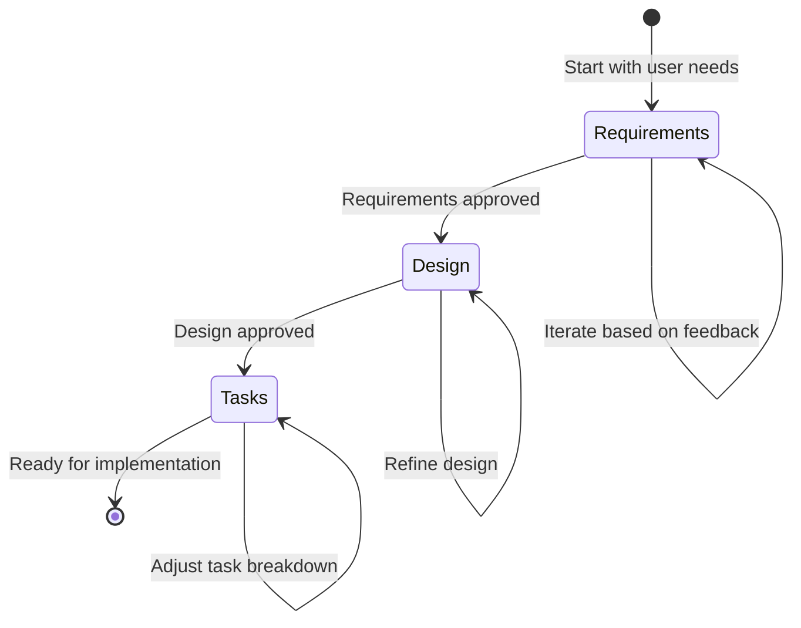

# Process Guide

<!-- Navigation Metadata -->
<!-- Section: Process | Level: Overview | Prerequisites: README.md -->
<!-- Related: templates/README.md, prompting/README.md, examples/simple-feature-spec.md -->

**📍 You are here:** [Main Guide](../../README.md) → **Process Guide**

## Quick Navigation
- **Prerequisites:** [Methodology Overview](../README.md) - Understand the foundation first
- **Templates:** [Ready-to-Use Templates](../templates/README.md) - Get started quickly
- **Examples:** [See Complete Specs](../examples/README.md) - Learn from real examples
- **AI Help:** [Prompting Strategies](../prompting/README.md) - Collaborate effectively with AI

---

Step-by-step walkthrough of the three-phase spec-driven development workflow.

## In This Section

- **[Requirements Phase](requirements-phase.md)** - Gathering and structuring requirements using EARS format
- **[Design Phase](design-phase.md)** - Creating comprehensive design documents with research
- **[Tasks Phase](tasks-phase.md)** - Breaking down design into actionable coding tasks
- **[Change Management](change-management.md)** - Managing spec evolution and handling discovered requirements
- **[Workflow Diagrams](workflow-diagrams.md)** - Visual process flows and decision points

## The Three-Phase Workflow

Each phase builds upon the previous one, with explicit approval gates to ensure quality and alignment before proceeding.

## Phase Overview

1. **Requirements** - Transform rough ideas into structured, testable requirements
2. **Design** - Research and architect a comprehensive solution
3. **Tasks** - Create an actionable implementation plan with discrete coding steps

---

## 🔗 Related Content

### Prerequisites
- [Methodology Overview](../README.md) - Understand the foundation first

### Next Steps
- [Requirements Phase](requirements-phase.md) - Start the three-phase process
- [Templates](../templates/README.md) - Get ready-to-use starting points

### Related Sections
- [Examples](../examples/README.md) - See complete process examples
- [Prompting Strategies](../prompting/README.md) - Get better AI collaboration
- [Execution Guide](../execution/README.md) - Implement your completed specs

[← Back to Main Guide](../../README.md) | [Start with Requirements →](requirements-phase.md)