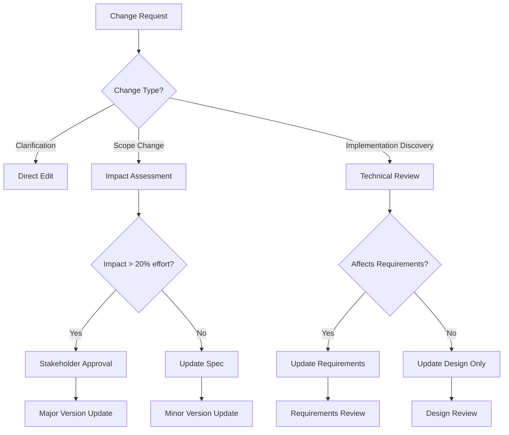

# Change Management

<!-- Navigation Metadata -->
<!-- Section: Process | Level: Advanced | Prerequisites: requirements-phase.md, design-phase.md -->
<!-- Related: execution/implementation-guide.md, templates/checklists.md -->


## Quick Navigation
- **Prerequisites:** [Requirements Phase](requirements-phase.md), [Design Phase](design-phase.md)
- **Templates:** [Checklists](../templates/checklists.md) - Change impact assessment guides
- **Execution:** [Implementation Guide](../execution/implementation-guide.md) - Handle discovered changes

---

Managing spec evolution and handling discovered requirements during implementation.

## Overview

Specs are living documents that evolve as understanding deepens. This guide covers strategies for managing changes while maintaining traceability and quality.

## Change Types

### 1. Clarification Changes
- **What:** Minor clarifications that don't affect scope
- **Examples:** Typo fixes, formatting improvements, clearer wording
- **Process:** Direct edit with commit message noting clarification

### 2. Scope Changes
- **What:** New requirements or modified existing ones
- **Examples:** Additional user stories, changed business rules
- **Process:** Full change impact assessment required

### 3. Implementation Discoveries
- **What:** Technical constraints discovered during coding
- **Examples:** API limitations, performance bottlenecks, security requirements
- **Process:** Update design phase, potentially requirements

## Change Decision Framework



## Version Control Strategy

### Semantic Versioning for Specs
- **Major (1.0.0 → 2.0.0):** Breaking changes to requirements or core design
- **Minor (1.0.0 → 1.1.0):** New requirements or significant design changes
- **Patch (1.0.0 → 1.0.1):** Clarifications, bug fixes, minor updates

### Branch Strategy
```
main/
├── spec-v1.0/          # Stable spec versions
├── feature/new-req     # New requirement branches
└── fix/clarification   # Minor fix branches
```

## Change Impact Assessment

### Questions to Ask
1. **Requirements Impact**
   - Does this change existing user stories?
   - Are new acceptance criteria needed?
   - Do any requirements become obsolete?

2. **Design Impact**
   - What components are affected?
   - Are new dependencies introduced?
   - Does the architecture need revision?

3. **Implementation Impact**
   - How many tasks need updating?
   - What's the estimated effort change?
   - Are there new risks or blockers?

### Impact Scoring
- **Low (1-2 points):** Clarifications, minor additions
- **Medium (3-5 points):** New features, moderate design changes
- **High (6-8 points):** Major scope changes, architecture revisions
- **Critical (9-10 points):** Fundamental requirement changes

## Change Workflow

### 1. Change Request Creation
```markdown
## Change Request: [Brief Description]

**Type:** [Clarification/Scope/Implementation Discovery]
**Requestor:** [Name/Role]
**Date:** [YYYY-MM-DD]

### Current State
[What exists now]

### Proposed Change
[What should change]

### Justification
[Why this change is needed]

### Impact Assessment
- Requirements: [None/Minor/Major]
- Design: [None/Minor/Major]
- Implementation: [None/Minor/Major]
- Effort Change: [+/- X hours/days]

### Approval Required
- [ ] Product Owner (for scope changes)
- [ ] Tech Lead (for design changes)
- [ ] Stakeholders (for major changes)
```

### 2. Review Process
1. **Technical Review:** Assess implementation feasibility
2. **Business Review:** Validate business value and priority
3. **Impact Analysis:** Calculate effort and timeline changes
4. **Approval Decision:** Go/No-go based on impact and value

### 3. Implementation
1. **Update Spec:** Modify affected sections
2. **Version Bump:** Update version according to change type
3. **Traceability:** Link changes to original requirements
4. **Communication:** Notify stakeholders of changes

## Handling Implementation Discoveries

### Common Discovery Types
1. **Technical Constraints**
   - Third-party API limitations
   - Performance requirements
   - Security considerations

2. **Integration Challenges**
   - Data format mismatches
   - Authentication complexities
   - Timing dependencies

3. **User Experience Issues**
   - Accessibility requirements
   - Mobile responsiveness
   - Browser compatibility

### Discovery Response Process
1. **Document Discovery:** Record what was found and why it matters
2. **Assess Options:** List possible solutions and trade-offs
3. **Update Spec:** Modify design or requirements as needed
4. **Validate Changes:** Ensure changes align with original goals

## Living Spec Practices

### Regular Review Cycles
- **Weekly:** Check for implementation discoveries
- **Sprint End:** Review completed tasks against spec
- **Monthly:** Assess overall spec health and accuracy

### Spec Health Metrics
- **Accuracy:** % of requirements that match implementation
- **Completeness:** % of implementation covered by spec
- **Currency:** Days since last meaningful update
- **Traceability:** % of code changes linked to spec items

### Maintenance Guidelines
1. **Keep It Current:** Update specs as implementation progresses
2. **Maintain Traceability:** Link all changes back to requirements
3. **Document Decisions:** Record why changes were made
4. **Communicate Changes:** Keep stakeholders informed

## Change Communication

### Stakeholder Notification
```markdown
## Spec Change Notification

**Spec:** [Spec Name v1.2.0]
**Change Type:** [Minor/Major]
**Date:** [YYYY-MM-DD]

### Summary
[Brief description of changes]

### Impact
- Timeline: [No change/+X days]
- Scope: [No change/Added/Removed features]
- Resources: [No change/+X hours]

### Action Required
- [ ] Review updated requirements
- [ ] Approve design changes
- [ ] Update project timeline

### Questions/Concerns
Contact: [Name] at [email]
```

## Tools and Integration

### Version Control Integration
- Use Git tags for spec versions
- Link commits to change requests
- Maintain changelog in spec repository

### Project Management Integration
- Update task estimates based on changes
- Create new tickets for change-driven work
- Link changes to original user stories

### Documentation Integration
- Auto-generate change logs
- Update API documentation
- Sync with project wikis

---

## 🔗 Related Content

### Prerequisites
- [Requirements Phase](requirements-phase.md) - Foundation for change management
- [Design Phase](design-phase.md) - Understanding design evolution

### Templates
- [Checklists](../templates/checklists.md) - Impact assessment guidelines

[← Back to Process Guide](README.md) | [Implementation Guide →](../execution/implementation-guide.md)