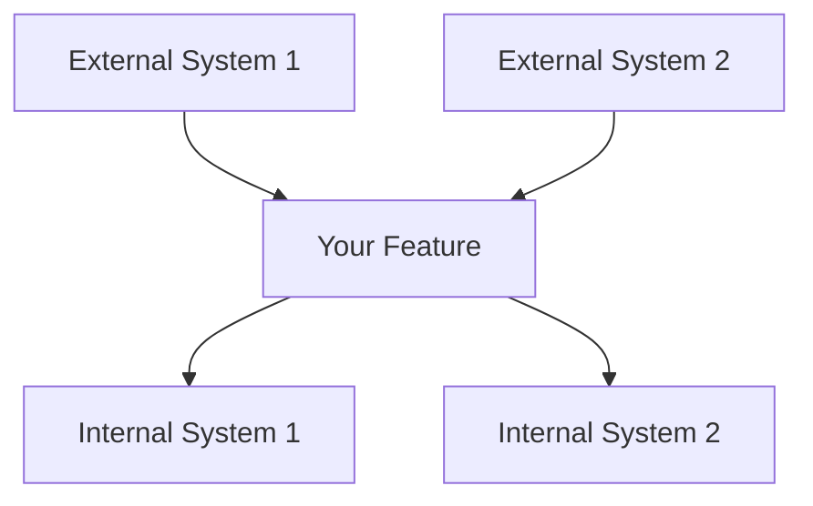
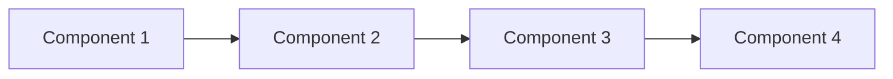
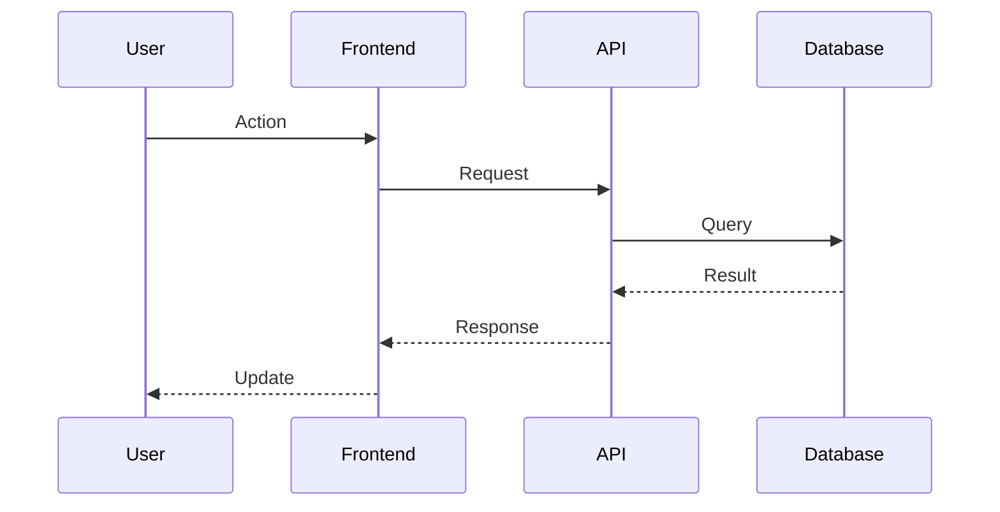

# Design Template

<!-- Navigation Metadata -->
<!-- Template: Design | Level: Template | Prerequisites: requirements-template.md -->
<!-- Related: process/design-phase.md, ai-reasoning/decision-frameworks.md, examples/complex-system-spec.md -->

**📍 You are here:** [Main Guide](../../README.md) → [Templates](README.md) → **Design Template**

## Quick Navigation
- **📚 Learn Process:** [Design Phase Guide](../process/design-phase.md) - How to use this template
- **📖 See Example:** [Complex System Design](../examples/complex-system-spec.md#design-document) - Template in action
- **🧠 Decision Help:** [Decision Frameworks](../ai-reasoning/decision-frameworks.md) - How to make design choices
- **➡️ Next Template:** [Tasks Template](tasks-template.md) - After design is done

---

Use this template to create comprehensive design documents that translate requirements into technical specifications.

## Document Information

- **Feature Name**: [Your Feature Name]
- **Version**: 1.0
- **Date**: [Current Date]
- **Author**: [Your Name]
- **Reviewers**: [List technical reviewers]
- **Related Documents**: [Link to requirements document]

## Overview

[Provide a high-level summary of the design approach. Explain how this design addresses the requirements and fits into the overall system architecture. Keep this section concise but comprehensive.]

### Design Goals
- [Primary goal 1]
- [Primary goal 2]
- [Primary goal 3]

### Key Design Decisions
- [Decision 1 and rationale]
- [Decision 2 and rationale]
- [Decision 3 and rationale]

## Architecture

### System Context
[Describe how this feature fits into the broader system. Include external dependencies and integration points.]



### High-Level Architecture
[Describe the overall architectural approach and major components.]



### Technology Stack
| Layer | Technology | Rationale |
|-------|------------|-----------|
| Frontend | [Technology] | [Why chosen] |
| Backend | [Technology] | [Why chosen] |
| Database | [Technology] | [Why chosen] |
| Infrastructure | [Technology] | [Why chosen] |

## Components and Interfaces

### Component 1: [Component Name]

**Purpose**: [What this component does]

**Responsibilities**:
- [Responsibility 1]
- [Responsibility 2]
- [Responsibility 3]

**Interfaces**:
- **Input**: [What it receives]
- **Output**: [What it produces]
- **Dependencies**: [What it depends on]

**Implementation Notes**:
- [Key implementation detail 1]
- [Key implementation detail 2]

### Component 2: [Component Name]

**Purpose**: [What this component does]

**Responsibilities**:
- [Responsibility 1]
- [Responsibility 2]

**Interfaces**:
- **Input**: [What it receives]
- **Output**: [What it produces]
- **Dependencies**: [What it depends on]

**Implementation Notes**:
- [Key implementation detail 1]
- [Key implementation detail 2]

### Component 3: [Component Name]

**Purpose**: [What this component does]

**Responsibilities**:
- [Responsibility 1]
- [Responsibility 2]

**Interfaces**:
- **Input**: [What it receives]
- **Output**: [What it produces]
- **Dependencies**: [What it depends on]

**Implementation Notes**:
- [Key implementation detail 1]
- [Key implementation detail 2]

## Data Models

### Entity 1: [Entity Name]

```typescript
interface EntityName {
  id: string;
  property1: string;
  property2: number;
  property3: boolean;
  createdAt: Date;
  updatedAt: Date;
}
```

**Validation Rules**:
- [Validation rule 1]
- [Validation rule 2]

**Relationships**:
- [Relationship to other entities]

### Entity 2: [Entity Name]

```typescript
interface EntityName {
  id: string;
  property1: string;
  property2: EntityName[];
  status: 'active' | 'inactive' | 'pending';
}
```

**Validation Rules**:
- [Validation rule 1]
- [Validation rule 2]

**Relationships**:
- [Relationship to other entities]

### Data Flow



## API Design

### Endpoint 1: [Endpoint Name]

**Method**: `POST`  
**Path**: `/api/v1/[resource]`

**Request**:
```json
{
  "property1": "string",
  "property2": "number",
  "property3": "boolean"
}
```

**Response**:
```json
{
  "id": "string",
  "property1": "string",
  "property2": "number",
  "createdAt": "ISO date string"
}
```

**Error Responses**:
- `400 Bad Request`: [When this occurs]
- `401 Unauthorized`: [When this occurs]
- `404 Not Found`: [When this occurs]

### Endpoint 2: [Endpoint Name]

**Method**: `GET`  
**Path**: `/api/v1/[resource]/{id}`

**Parameters**:
- `id` (path): [Description]
- `include` (query, optional): [Description]

**Response**:
```json
{
  "id": "string",
  "property1": "string",
  "property2": "number"
}
```

## Security Considerations

### Authentication
- [Authentication method and implementation]
- [Token management approach]

### Authorization
- [Authorization model and rules]
- [Permission checking strategy]

### Data Protection
- [Data encryption approach]
- [PII handling procedures]
- [Data retention policies]

### Input Validation
- [Validation strategies]
- [Sanitization procedures]
- [Rate limiting approach]

## Error Handling

### Error Categories
| Category | HTTP Status | Description | User Action |
|----------|-------------|-------------|-------------|
| Validation | 400 | Invalid input data | Fix input and retry |
| Authentication | 401 | Invalid credentials | Re-authenticate |
| Authorization | 403 | Insufficient permissions | Contact administrator |
| Not Found | 404 | Resource doesn't exist | Check resource identifier |
| Server Error | 500 | Internal system error | Retry later or contact support |

### Error Response Format
```json
{
  "error": {
    "code": "ERROR_CODE",
    "message": "Human-readable error message",
    "details": {
      "field": "Specific field error"
    },
    "timestamp": "ISO date string",
    "requestId": "unique-request-id"
  }
}
```

### Logging Strategy
- **Error Logs**: [What gets logged for errors]
- **Audit Logs**: [What gets logged for auditing]
- **Performance Logs**: [What gets logged for monitoring]

## Performance Considerations

### Expected Load
- **Concurrent Users**: [Number]
- **Requests per Second**: [Number]
- **Data Volume**: [Size/Growth rate]

### Performance Requirements
- **Response Time**: [Target response times]
- **Throughput**: [Target throughput]
- **Availability**: [Uptime requirements]

### Optimization Strategies
- [Caching strategy]
- [Database optimization approach]
- [CDN usage]
- [Load balancing approach]

### Monitoring and Metrics
- [Key performance indicators]
- [Monitoring tools and dashboards]
- [Alert thresholds]

## Testing Strategy

### Unit Testing
- **Coverage Target**: [Percentage]
- **Testing Framework**: [Framework name]
- **Key Test Areas**: [Critical functionality to test]

### Integration Testing
- **API Testing**: [Approach and tools]
- **Database Testing**: [Approach and tools]
- **External Service Testing**: [Mocking strategy]

### End-to-End Testing
- **User Scenarios**: [Key user journeys to test]
- **Testing Tools**: [E2E testing framework]
- **Test Environment**: [Environment setup]

### Performance Testing
- **Load Testing**: [Approach and tools]
- **Stress Testing**: [Limits to test]
- **Monitoring**: [Performance metrics to track]

## Deployment and Operations

### Deployment Strategy
- [Deployment approach (blue-green, rolling, etc.)]
- [Environment progression]
- [Rollback procedures]

### Configuration Management
- [Configuration approach]
- [Environment-specific settings]
- [Secret management]

### Monitoring and Alerting
- [Health checks]
- [Key metrics to monitor]
- [Alert conditions and escalation]

### Maintenance Procedures
- [Regular maintenance tasks]
- [Backup and recovery procedures]
- [Update and patching strategy]

## Migration and Compatibility

### Data Migration
- [Migration strategy if applicable]
- [Data transformation requirements]
- [Rollback procedures]

### Backward Compatibility
- [API versioning strategy]
- [Breaking change procedures]
- [Deprecation timeline]

### Integration Impact
- [Impact on existing systems]
- [Required changes to dependent systems]
- [Communication plan for changes]

---

## Design Review Checklist

Use this checklist to validate your design document:

### Architecture
- [ ] High-level architecture is clearly described
- [ ] Component responsibilities are well-defined
- [ ] Interfaces between components are specified
- [ ] Technology choices are justified

### Requirements Alignment
- [ ] Design addresses all functional requirements
- [ ] Non-functional requirements are considered
- [ ] Success criteria can be met with this design
- [ ] Constraints and assumptions are addressed

### Technical Quality
- [ ] Design follows established patterns and principles
- [ ] Security considerations are addressed
- [ ] Performance requirements are considered
- [ ] Error handling is comprehensive

### Implementation Readiness
- [ ] Design provides sufficient detail for implementation
- [ ] Data models are complete and validated
- [ ] API specifications are detailed
- [ ] Testing strategy is comprehensive

### Maintainability
- [ ] Design supports future extensibility
- [ ] Components are loosely coupled
- [ ] Configuration is externalized
- [ ] Monitoring and observability are included

---

## Design Patterns Reference

### Common Patterns to Consider

**Creational Patterns**:
- Factory: When you need to create objects without specifying exact classes
- Builder: When constructing complex objects step by step
- Singleton: When you need exactly one instance of a class

**Structural Patterns**:
- Adapter: When integrating incompatible interfaces
- Decorator: When adding behavior without altering structure
- Facade: When simplifying complex subsystem interfaces

**Behavioral Patterns**:
- Observer: When objects need to be notified of state changes
- Strategy: When you need to switch between algorithms
- Command: When you need to parameterize objects with operations

**Architectural Patterns**:
- MVC/MVP/MVVM: For separating presentation from business logic
- Repository: For abstracting data access logic
- Unit of Work: For maintaining consistency across multiple operations

---

[← Requirements Template](requirements-template.md) | [Tasks Template →](tasks-template.md)