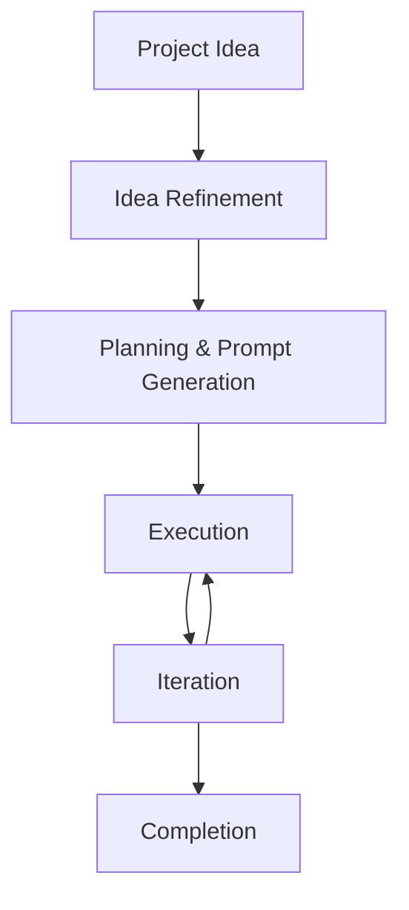

# Vibe Coding Plus Development Workflow

For smaller projects or rapid prototyping, a streamlined approach to AI-assisted development can be more effective than the comprehensive workflow outlined in the previous sections. This Vibe Coding Plus workflow is inspired by modern practices in AI-driven development and focuses on speed, iteration, and minimal overhead.

## When to Use This Workflow

This Vibe Coding Plus approach is ideal for:

- **Small to medium-sized projects** (can be completed in days or weeks)
- **Proof of concepts** and prototypes
- **Personal projects** or side projects
- **Greenfield development** where you're starting from scratch
- **Rapid iteration** requirements
- **Solo development** or very small teams

## Workflow Overview

The Vibe Coding Plus workflow follows a simple three-step pattern that can be completed in minutes rather than hours:



*Image: Vibe Coding Plus development workflow diagram*

## Step 1: Idea Refinement

Use a conversational AI model to refine your project idea into a clear, actionable specification. This step typically takes 10-15 minutes.

### Process

1. **Start with a focused prompt** to guide the AI in asking clarifying questions:

```prompt
Ask me one question at a time so we can develop a thorough, step-by-step spec for this coding project. Each question should build on my previous answers, and our end goal is to have a detailed specification I can hand off to a developer. Let's do this iteratively and dig into every relevant detail. Remember, only one question at a time.

Here's the idea:
<YOUR_PROJECT_IDEA>
```

2. **Engage in the conversation** - Answer each question thoughtfully, as this forms the foundation of your project
3. **Generate the final specification** once the brainstorming feels complete:

```prompt
Now that we've wrapped up the brainstorming process, can you compile our findings into a comprehensive, developer-ready specification? Include all relevant requirements, architecture choices, data handling details, error handling strategies, and a testing plan so a developer can immediately begin implementation.
```

4. **Save the output** as `spec.md` in your project repository

### Benefits

- **Clarity**: Forces you to think through all aspects of your project
- **Completeness**: Ensures you haven't missed important requirements
- **Handoff ready**: Creates documentation that can be shared with others
- **Reusability**: The spec can be used for multiple purposes (development, business planning, etc.)

## Step 2: Planning & Prompt Generation

Transform your specification into a series of executable development prompts. This step typically takes 5-10 minutes.

### Process

1. **Use a reasoning model** (like Claude, GPT-4, or similar) with your specification:

```prompt
Draft a detailed, step-by-step blueprint for building this project. Then, once you have a solid plan, break it down into small, iterative chunks that build on each other. Look at these chunks and then go another round to break it into small steps. Review the results and make sure that the steps are small enough to be implemented safely with strong testing, but big enough to move the project forward. Iterate until you feel that the steps are right sized for this project.

From here you should have the foundation to provide a series of prompts for a code-generation AI that will implement each step in a test-driven manner. Prioritize best practices, incremental progress, and early testing, ensuring no big jumps in complexity at any stage. Make sure that each prompt builds on the previous prompts, and ends with wiring things together. There should be no hanging or orphaned code that isn't integrated into a previous step.

Make sure and separate each prompt section. Use markdown. Each prompt should be tagged as text using code tags. The goal is to output prompts, but context, etc is important as well.

<SPEC_CONTENT>
```

2. **Generate a checklist** for tracking progress:

```prompt
Can you make a `todo.md` that I can use as a checklist? Be thorough.
```

3. **Save the outputs** as `prompt_plan.md` and `todo.md` in your project repository

### Benefits

- **Structured approach**: Breaks complex projects into manageable steps
- **Quality assurance**: Emphasizes testing and best practices
- **Progress tracking**: Provides clear checkpoints and milestones
- **Flexibility**: Can be adapted for different AI coding tools

## Step 3: Execution

Execute your development plan using your preferred AI coding tool. This is where the actual development happens.

### Tool Options

**Option A: Conversational AI (Claude, ChatGPT)**
- Copy and paste each prompt from your plan
- Manually transfer generated code to your IDE
- Good for maintaining control and understanding
- Requires more manual work but provides learning opportunities

**Option B: AI-Powered IDE (Cursor, Windsurf)**
- Execute prompts directly in your development environment
- Faster iteration with integrated testing
- Better context awareness of your codebase
- Ideal for rapid development

**Option C: Command-Line AI Tools (Aider, Claude Code)**
- Terminal-based development with AI assistance
- Excellent for automation and scripting
- Can run tests and make commits automatically
- Best for experienced developers comfortable with command-line workflows

### Execution Process

1. **Set up your project structure** (initialize repository, install dependencies, create basic files)
2. **Execute prompts sequentially** from your `prompt_plan.md`
3. **Test after each step** to ensure quality and catch issues early
4. **Update your `todo.md`** to track completed items
5. **Commit frequently** with meaningful commit messages
6. **Iterate and refine** as needed

### Best Practices

- **Start simple**: Begin with basic functionality before adding complexity
- **Test continuously**: Run tests after each significant change
- **Commit often**: Small, frequent commits are easier to debug and rollback
- **Stay focused**: Resist the urge to add features not in your original spec
- **Document as you go**: Update README and comments for future reference

## Iteration and Refinement

The Vibe Coding Plus workflow is designed for rapid iteration:

### Quick Feedback Loops

- **Immediate testing**: Verify each step works before moving to the next
- **User feedback**: Share prototypes early and often
- **Performance monitoring**: Keep an eye on speed and resource usage
- **Code quality**: Use linting and formatting tools to maintain standards

### Adaptation Strategies

- **Scope adjustment**: Remove or simplify features that are taking too long
- **Technology pivots**: Switch tools or frameworks if current approach isn't working
- **Requirement changes**: Update your spec if you discover new requirements
- **Quality improvements**: Refactor code that becomes difficult to maintain

## Advantages of the Vibe Coding Plus Workflow

- **Speed**: Projects can be completed in hours or days rather than weeks
- **Low overhead**: Minimal documentation and process requirements
- **Flexibility**: Easy to adapt and change direction
- **Learning friendly**: Great for experimenting with new technologies
- **Cost effective**: Less time spent on planning and documentation

## Limitations

- **Scalability**: May not work well for large, complex projects
- **Team coordination**: Designed primarily for solo or small team development
- **Long-term maintenance**: May require refactoring for production use
- **Documentation**: Less comprehensive documentation than the full workflow
- **Risk management**: Fewer safeguards against technical debt

## Integration with Full Workflow

The Vibe Coding Plus workflow can serve as a stepping stone to the full AI development workflow:

- **Proof of concept**: Use Vibe Coding Plus approach to validate ideas
- **Prototype development**: Build initial versions quickly
- **Feature exploration**: Test new functionality before full implementation
- **Learning and training**: Help team members get comfortable with AI tools

Once a project proves valuable or grows in complexity, you can transition to the more comprehensive workflow outlined in the earlier sections.

## Next Steps

- **Try it out**: Start with a small project to get familiar with the process
- **Experiment with tools**: Test different AI coding assistants to find your preference
- **Build your prompt library**: Save successful prompts for future projects
- **Share your experience**: Document what works and what doesn't for your team
- **Consider scaling up**: Evaluate when to transition to the full workflow

## Tips for Success

- **Keep it simple**: Don't over-engineer your initial approach
- **Focus on working software**: Prioritize functionality over perfect code
- **Learn from failures**: Each project teaches valuable lessons
- **Build incrementally**: Small steps are easier to debug and understand
- **Stay curious**: Experiment with new AI tools and techniques as they emerge

The Vibe Coding Plus workflow represents a pragmatic approach to AI-assisted development, balancing speed and quality for smaller projects while maintaining the flexibility to scale up when needed. 