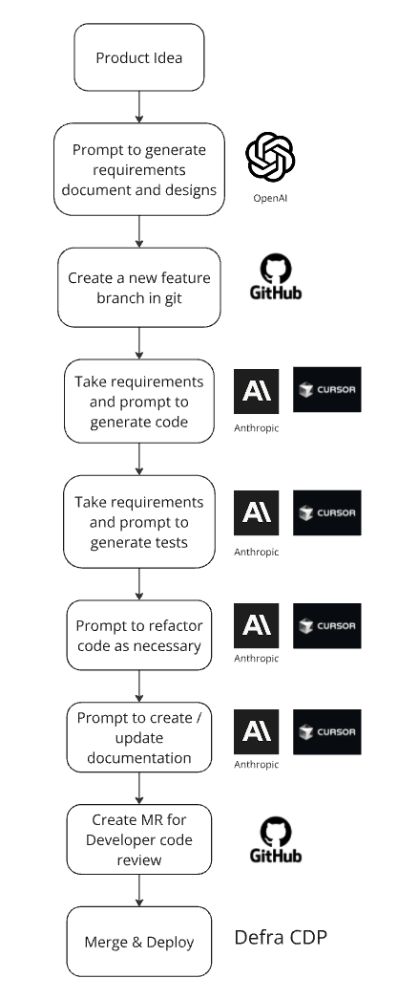

# Getting Started

To get started working with AI ways of working, it's helpful to have a conceptual understanding of how to use this playbook to generate quality, consistent code.

## Workflow overview

Below is a diagram that provides a high-level overview of the steps defined in this playbook. For the most part, this development workflow follows recognised best practices already established throughout government, with the additional aid of AI tools and techniques.

*Image: Simplified development workflow diagram*

### Key stages of the workflow

- **Product / Service idea** - This represents the problems to be solved for your users using existing service design and user research techniques.
- **Prompt to generate requirements documents and designs** - Using advanced models, such as the latest "thinking" models, the clearly defined ideas can be used to generate requirements documentation (features, user stories, data models, etc.) that the AI IDEs (Integrated Development Environment - Cursor) can later use to generate code. 
- **Create a new feature branch in git** - This workflow uses traditional git branching strategies for code versioning.
- **Take requirements and prompt to generate code** - The requirements generated in the previous step are then used to prompt the AI IDE tools to generate code.
- **Take requirements and prompt to generate tests** - Tests can be generated from the same product requirements in the AI IDE, ensuring the business logic defined in the requirements are tested independently from the code generation.
- **Prompt to refactor as necessary** - Additional refactoring of the code can also be prompted at this point.
- **Prompt to create / update documentation** - Documentation can be kept up to date by prompting the AI IDE to update documentation based on the changes that have been made.
- **Create MR for developer code review** - A Merge Request (MR) in git is then generated following traditional development practices. Each line of code is reviewed for quality and brevity, ensuring that the code to be deployed is production-ready.
- **Merge & Deploy** - Once the MR is merged into the main branch, the automated pipeline processes are used to deploy the code, as per your normal deployment processes.

## Generating Consistent Code

To generate consistent code, multiple elements must come together as depicted in this diagram:

*Image: Venn diagram depicting the intersection of elements for consistent AI code generation*

| Element                       | Purpose                                                                                                                                                                                                                                  | Where created                                                                                                                                                                                                                                                    |
| ----------------------------- | ---------------------------------------------------------------------------------------------------------------------------------------------------------------------------------------------------------------------------------------- | ---------------------------------------------------------------------------------------------------------------------------------------------------------------------------------------------------------------------------------------------------------------- |
| Clear Requirements            | Defines (with detail and clarity) the functional and pseudo-technical requirements for the product/service idea you want to implement.                                                                                                   | Using an advanced "thinking" chat model like Claude or ChatGPT. - Ref: [Product Requirements Workflow](workflow-product-requirements.md)                                                                                                                      |
| Good Prompts                  | The clear, detailed ask for a given task. It can refer to the IDE rules and the requirements, however, it is not necessary to repeat what's in the rules or requirements in the prompt.                                                  | Prompts are initially created manually but then can be further refined using a chat model like Claude or ChatGPT. - Prompt engineering and meta prompting is explained further in the playbook: [Prompting Guidance](../prompt-library/prompting-guidance.md) |
| IDE Rules for AI              | IDE rules define consistent and repeatable standards, patterns and conventions across the codebase. Rules can be applied for each task-specific prompt.                                                                                  | Rule file formats are usually defined by the AI IDE tool. To aid in generating the rules themselves, a chat model like Claude or ChatGPT can be used. - Ref: [Language-specific playbook rules files](../language-specific/README.md)                         |
| Capable Code Generation Model | Using the most capable LLM model for the task you are running is important for good quality results. Not all tasks require advanced models, so selection of the most cost-effective model that can achieve the desired outcome is ideal. | The AI IDE tools typically allow the user to select which model is used when prompting the LLM. - Currently, the latest Claude Sonnet models are recommended starting models for quality code generation.                                                     |

## Next steps

To get started, ensure that your [project is set up for AI development](workflow-project-setup.md) and follow the steps in the [Playbook Workflow](README.md). **IMPORTANT - this includes ensuring that privacy settings are enabled, per the [project is set up](workflow-project-setup.md).** 

We also advise reading and understanding the detailed [Prompting Guidance](../prompt-library/prompting-guidance.md) before you start.
