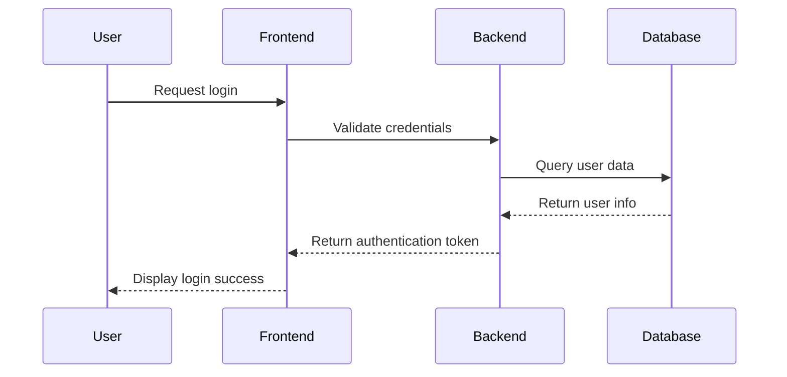
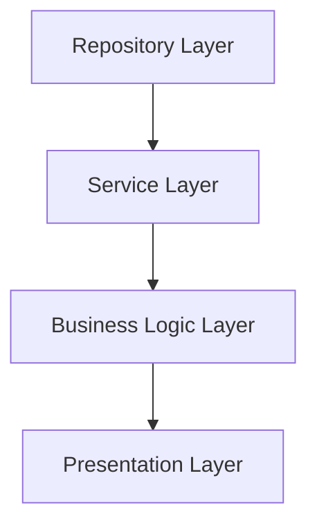

# Documentation

## Overview

Leveraging an AI-powered development workflow, such as utilising large language models (LLMs), makes it easier to create and maintain high-quality, readable documentation. 

This documentation can be in the form of helpful user guides like README.md files aimed at setting the scene of what the repository is for and how to set up the required libraries and environment in order to start developing on the codebase. This is part of traditional repository hygiene and updating these documents should be done regularly.

This section outlines best practices for incorporating documentation into your development workflow and how to maximise the benefits of LLM capabilities.

## Guidelines

### Have a Documentation Rules File

To ensure that documentation adheres to a specific standard or company guidelines, it is recommended to create a documentation rules file. This file can include a template or checklist with items such as:

- **Consistency Guidelines:** Naming conventions, formatting rules, and style preferences.
- **Content Requirements:** Mandatory sections (e.g., Overview, Setup, Usage, Contribution Guidelines).
- **Review Process:** How and when documentation should be reviewed or updated.
- **Examples:** Sample snippets or diagrams to follow. (Optional)

This template ensures that every document maintains a baseline level of quality and clarity, making it easier for both human collaborators and LLMs to understand and process the documentation.

### Keep Your Documents Up to Date

Update documentation whenever you make changes to the codebase. This practice:
- helps team members understand recent changes
- ensures the LLM has an accurate understanding of the current system
- reduces technical debt
- makes onboarding new team members easier

Use the [prompt-add-update-documentation](../prompt-library/documentation-writing/prompt-add-update-documentation.md) prompt to have the LLMs update the codebase documentation regularly.

As the codebase grows, the importance of comprehensive documentation increases. Without it, the LLM's effectiveness in managing and evolving the system diminishes. Regularly revisiting and enriching documentation ensures that both human and AI contributors can operate efficiently in a complex development environment.

### Embedding Documentation into Development

Consider documentation as an integral part of the development lifecycle (ref: [workflow-development](workflow-development.md)), not a separate task to be completed later. LLMs make it straightforward to maintain clear and consistent documentation as you work, generating drafts for function descriptions, usage guides and code doc-strings in real-time.

### Using Documentation as a Knowledge Base

Well-maintained documentation serves as a vital knowledge base for both team members and LLMs. It provides:

- **Contextual Assistance:** Feeding detailed documentation into the LLM helps it understand the context and history behind implementation decisions. For example, when an LLM reviews a legacy function, it can refer back to a well-documented design decision to suggest updates or improvements.
- **Error Reduction:** Maintaining a knowledge base minimizes the likelihood of errors or redundant changes by providing a clear reference for what has been implemented.
- **Predictive Generation:** With a robust documentation base, the LLM can predictively generate solutions aligned with existing patterns and architectural decisions.

## Advanced Visual Documentation

### Creating Complex Visuals

LLMs can generate complex visual aids to support documentation, improving clarity and understanding. Examples include:

- **Sequence Flow Diagrams**: Use Mermaid to create diagrams that show, for example:
  - API request/response flows
  - User authentication processes
  - Data transformation pipelines
- **Conceptual Data Models**: Visualise system architecture using, for example:
  - Database schema diagrams
  - Service interaction maps
  - Component dependency graphs

Below are some example Mermaid diagrams:

#### Example 1: Sequence Flow Diagram



#### Example 2: Component Dependency Diagram




These visuals help developers, stakeholders, and the LLM itself to contextualise the system's design and logic effectively.

## Creating Technical Documentation

In addition to your typical repository documentation, having technical documentation for the LLM to reference is an excellent way of quickly providing context without overloading its context window. A helpful side effect is that it can be used to compare documentation based on 'implementation' versus your typical user-made architectural or user requirements documents.

Additionally, these documents are beneficial when starting to work in a legacy codebase that may have no documentation or only outdated information.

### Software Layers

To generalize the software documentation process, the workflow splits the documentation using the software architecture layering paradigm. For example, the repository layer handles data access, while the service layer contains business logic. Documenting each layer clarifies the role of each component in one document—providing a large amount of context in one condensed representation.

The entry point to use these prompts starts at the same place shown below, of note - you should have already run the [prompt-add-update-documentation](../prompt-library/documentation-writing/prompt-add-update-documentation.md):

```
Run {{PROMPT_FOR_CREATING_DOCUMENTATION.md}} after reviewing the entire codebase.

Also consult @ARCHITECTURE.md and use documentation.mdc as a cursor rule.

Export your report as a markdown file in /docs
```

It is best to use this prompt with a advanced reasoning model as this helps the model gather more context and 'reason' about the implementation of the code and why some of the functionality is present in addition to what it is doing.

The prompts to create technical documentation are below:
- [prompt-create-api-documentation](../prompt-library/documentation-writing/prompt-create-api-documentation.md)
- [prompt-create-service-layer-documentation](../prompt-library/documentation-writing/prompt-create-service-layer-documentation.md)
- [prompt-create-business-logic-documentation](../prompt-library/documentation-writing/prompt-create-business-logic-documentation.md)
- [prompt-create-repository-documentation](../prompt-library/documentation-writing/prompt-create-repository-documentation.md)

This provides a great starting point for creating business case documentation and user stories for features.

## Best Practices

1. Treat documentation updates as part of your definition of "done" for each development task.
2. Use LLMs to draft, review, and refine documentation continuously.
3. Integrate tools like Mermaid for visualisation to enhance clarity.
4. Regularly review documentation to ensure accuracy, completeness, and relevance.

By embedding these practices into your development workflow, you can ensure a robust, scalable, and efficient system that benefits from both human and AI collaboration.